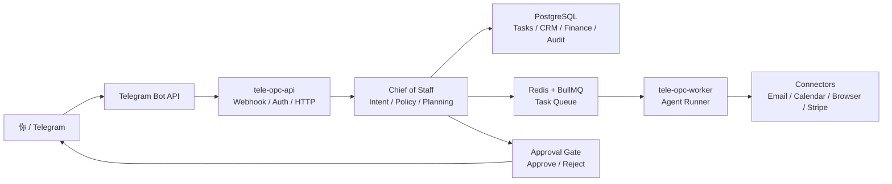

# Tele-OPC OS

Telegram-first One-Person Company Operating System

中文：Telegram 优先的一人公司操作系统

> 当前状态：V3.2 Agent OS MVP。仓库已经有可运行的 Node.js/TypeScript 基础服务、Telegram webhook、Owner allowlist、任务/审批/审计表、PostgreSQL migration、Redis/BullMQ 任务队列、worker 状态闭环、公司记忆、Planner、Review Loop、内部 CRM、邮件手工分拣、SMTP/Nodemailer Campaign 邮件发送、内部财务台账、内部日程台账、浏览器运行审计、Ops/Governance，以及 V3 Agent Registry、Skill Registry、最小 AI Agent Runtime、Domain Router / Skill Router 预路由 handoff、Research Agent 前置研究计划、Chief -> Specialist handoff、并行多 Agent、外部写入审批记录、Guardrails Console、Ops Agent 治理判断、`agent_runs` / `tool_calls` 轨迹、`/trace` 多 Agent run 轨迹、`/solve` 多领域方案、`/prospect` 客户挖掘、公开来源 prospecting connector、`/send_campaign` 邮件 campaign 发送、`/campaign_event` 手工事件回传、`/import` 文本价格表导入、`/quote` 标准报价草案和 Markdown artifact、`/content` 内容草稿与发布计划、`/dev` Dev Agent AI Runtime 规划和 V3 专用 run 数据表写入。真实地图/付费企业名录 connector、真实 Gmail/Outlook 收件箱同步、Calendar/Stripe/银行/Playwright runner、报价 PDF/文件上传解析、Claude Code connector 和生产级外部执行器仍在路线图中。

## 文档导航

如果你要直接部署或准备放到 GitHub，先看这几份：

- [DEPLOYMENT.zh-CN.md](./DEPLOYMENT.zh-CN.md)：从本地开发到 VPS / Docker Compose / Telegram webhook 的完整部署配置手册。
- [RELEASE_CHECKLIST.zh-CN.md](./RELEASE_CHECKLIST.zh-CN.md)：公开 GitHub 或私有 Git 仓库发布前检查清单。
- [README.zh-CN.md](./README.zh-CN.md)：中文 Telegram 使用说明。
- [V3_AGENT_OS_ROADMAP.zh-CN.md](./V3_AGENT_OS_ROADMAP.zh-CN.md)：V3 Agent OS 实施路线图和当前勾选状态。
- [V2_LONG_TERM_PLAN.zh-CN.md](./V2_LONG_TERM_PLAN.zh-CN.md)：V2 历史规划参考。
- [V2_IMPLEMENTATION_ROADMAP.zh-CN.md](./V2_IMPLEMENTATION_ROADMAP.zh-CN.md)：V2 历史实施路线参考。
- [SECURITY.md](./SECURITY.md)：安全策略和 secret 处理边界。
- [CONTRIBUTING.md](./CONTRIBUTING.md)：贡献和开发约定。

最短本地启动路径：

```bash
cp .env.example .env
cp config/tele-opc.example.yaml config/tele-opc.yaml
npm install
docker compose up -d postgres redis
npm run db:migrate
npm run dev
```

生产部署建议使用 Docker Compose：

```bash
docker compose build
docker compose up -d postgres redis
docker compose run --rm api npm run db:migrate:prod
docker compose up -d api worker
docker compose run --rm api npm run telegram:set-webhook:prod
```

## 这是什么

Tele-OPC OS 是一个通过 Telegram 驱动的一人公司 Agent OS。你把 Telegram 当作移动驾驶舱，系统把任务队列、公司记忆、审批闸门、CRM、财务、邮件、日历、浏览器自动化、行业 Skill、职能 Skill 和多个 AI Agent 组织在一起。

它不是普通聊天机器人。它的设计目标是：

- 你用自然语言发出经营指令。
- 系统把指令转成可追踪任务。
- 低风险动作自动排队处理。
- 高风险动作先起草、展示证据、等待你批准。
- 所有关键动作写入审计日志。
- 后续逐步接入 CRM、财务、邮件、日历、浏览器自动化和业务 Agent。
- V3.2 额外支持 `/solve` 处理多领域经营问题，`/prospect` 生成客户挖掘和销售开发计划，`/quote` 生成标准报价草案和 Markdown artifact，`/content` 生成内容草稿和发布计划，`/dev` 触发 Dev Agent AI Runtime 规划，`/agents` / `/industry` 查看 Agent 与 Skill。



## 当前实现状态

已经实现：

- Node.js 20+ / TypeScript 项目骨架。
- Fastify API 服务。
- `/health` 和 `/ready` 健康检查。
- Telegram webhook：
  - `POST /telegram/webhook`
  - `POST /telegram/webhook/:secret`
- Telegram owner allowlist。
- PostgreSQL migration。
- Redis / BullMQ worker 骨架。
- 低风险任务自动进入 BullMQ 队列。
- 高风险任务等待审批，批准后进入队列，拒绝后阻塞。
- worker v0 消费任务并更新 `queued -> running -> done`。
- V3 Agent OS MVP：
  - `Agent Registry`：包含 Chief、Domain Router、Skill Router、Solution、Prospecting、ICP、Lead Scoring、Sales Sequence、Quote、Content、Dev Agent Team、CRM、Email、Calendar、Finance、Browser、Ops 等角色。
  - `Skill Registry`：内置行业 Skill 和职能 Skill，包括餐饮/本地生活、跨境电商、SaaS/软件服务、内容 IP/自媒体、市场调研、客户挖掘、CRM 跟进、报价、财务模型、项目管理、合规检查、浏览器研究。
  - `/solve <问题>` 创建 Solution workflow，生成问题重述、假设、证据计划、方案选项、推荐、风险和 7/30/90 天行动计划。
  - `/prospect <领域/ICP>` 创建 Prospecting workflow，生成 ICP、公开来源策略、评分模型、触达草稿、14 天 sequence、候选 lead、lead_scores、enrichment_results 和合规边界；配置 `PROSPECTING_PUBLIC_SOURCE_URLS` 后会抓取公开目录/搜索/招聘/新闻页面并写入 `public_source_observed` 候选。
  - `/leads` 展示候选线索种子；`/campaigns` 展示当前 prospecting campaign 和 planned/sent/replied/opened/unsubscribed campaign_events。
  - `/send_campaign <campaign_id>` 使用 SMTP/Nodemailer 自动发送 Campaign 邮件，不需要审批；`/campaign_event <campaign_id> <event_type> [lead_id] [备注]` 手工记录回复、打开、退订和退信事件。
  - `/import 价格表：...` 导入文本价格表，解析服务项、价格、币种和计费单位，并写入 `pricing` memory。
  - `/quote <需求>` 读取 pricing memory，生成报价依据、小计、假设、风险提示、邮件草稿和 Markdown/HTML 报价草案，并把 Markdown 报价文档草案写入 `artifacts`；配置模型后也会调用 Quote Agent AI Runtime。
  - `/content <需求>` 创建 Content Agent 任务链；配置模型后会调用 Content Agent AI Runtime 生成内容草稿、标题/开头备选、脚本和发布计划。
  - `/dev <任务>` 创建 Dev Agent Team 任务链；配置模型后会调用 Dev Agent AI Runtime 生成开发计划、影响范围、测试计划和风险。
  - 最小 AI Agent Runtime：OpenAI-compatible `ModelProvider`、`AgentRunner`、per-agent prompt、只读工具调用、`agent_runs` / `tool_calls` 轨迹。
  - AI-first principle: the model handles Agent reasoning, planning, and tool selection; TypeScript handles tools, permissions, state, audit, and deterministic fallback workflows.
  - Consultative natural-language questions run a Domain Router -> Skill Router -> Chief Agent pre-routing handoff before the final Chief response.
  - `/solve` and `/prospect` first run Research Agent to produce an evidence plan, public-source plan, and assumptions before handing context to Solution / Prospecting Agent.
  - `/ops` first renders deterministic governance data; when a model is configured, Ops Agent reads that context and returns health judgment, risk, and next-step advice.
  - Natural-language consulting, `/solve`, `/prospect`, `/quote`, `/content`, `/dev`, plus CRM/Email/Finance/Calendar/Browser natural-language write or run entries call real AI Agent Runtime when a model is configured; without model config they fall back to local workflows.
  - `/agents`、`/agent <id>`、`/industry`、`/industry <skill_id>`、`/kb`、`/runs`、`/trace <agent_run_id>`、`/settings guardrails` 提供 Agent/Skill/Run/Guardrails 可见性。
  - `/solve` 会写入 `solution_runs`、`evidence_items`、`assumptions`、`risk_items`。
  - `/prospect` 会写入 `prospecting_runs`、`lead_sources`、`leads`、`lead_scores`、`enrichment_results`、`outreach_sequences`、`campaigns` 和 planned `campaign_events`。公开来源 connector 命中的候选会标记为 `public_source_observed`，并自动 upsert `organizations`；有公开邮箱/电话时会创建 `contacts` 并关联 lead。未配置或未命中时使用 `needs_public_verification` 种子。
  - CRM、Email、Finance、Calendar、Browser 的本地工具层会先完成可审计记录；配置模型后，对应 Specialist Agent 会读取结构化上下文生成判断、风险和下一步建议。
- Company Memory v0：
  - `memories` 和 `memory_sources` 数据表。
  - 发送 `记住：...` 写入公司记忆。
  - `/memory` 查看最近公司记忆。
  - `/memory preference` 等按类型过滤。
  - 起草邮件/跟进内容时读取偏好和 playbook 记忆。
  - 审批 payload 记录草稿使用过的记忆和约束。
- Planner v1：
  - 识别规划、计划、拆解、流程类复杂任务。
  - 自动拆出子任务。
  - 为子任务分配初始 owner agent。
  - 写入顺序依赖到 `task_dependencies`。
  - `/task <id>` 展示父任务的拆解结果。
- Review Loop v0：
  - `reviews`、`playbooks`、`artifacts`、`briefings` 数据表。
  - `/review <task_id> <复盘内容>` 生成任务复盘。
  - 复盘内容提到 SOP、流程、标准、沉淀或复用时自动生成 playbook。
  - `/reviews` 查看最近任务复盘。
  - `/playbooks` 查看已沉淀 playbook。
- Internal CRM v0：
  - `contacts`、`organizations`、`opportunities`、`interactions`、`follow_ups`、`customer_segments` 数据表。
  - 发送 `把 Jane 加为新线索，她来自 Acme，对企业版感兴趣。` 创建 CRM 线索。
  - 自动创建公司、联系人、机会、互动记录和跟进事项。
  - `/crm` 查看热线索、逾期跟进、近期跟进、开放机会和风险客户。
- Email v0：
  - `email_accounts`、`email_threads`、`email_messages`、`email_drafts` 数据表。
  - 发送 `记录邮件 Jane <jane@acme.com> 主题：企业版咨询 正文：客户想了解报价，需要回复。` 手工导入邮件。
  - 自动识别紧急、客户、财务、日历、newsletter 和 ignored 分类。
  - 自动创建或关联联系人、邮件线程、邮件消息、跟进任务和回复草稿。
  - 需要回复的邮件会创建草稿和内部跟进任务；V3 默认不再把普通单封客户邮件草稿作为高风险审批。
  - Campaign 邮件发送使用 SMTP/Nodemailer 自动执行，不需要审批；非邮件批量触达、表单提交、付款、发布、部署等高风险动作仍需要确认。
  - `/mail` 查看紧急邮件、客户邮件、财务邮件、日历邮件和邮件草稿。
- Finance v0：
  - `vendors`、`transactions`、`invoices`、`subscriptions`、`budgets`、`cashflow_snapshots` 数据表。
  - 发送 `记录收入 12000 元 来自 Acme，企业版订阅。` 手工记录收入。
  - 发送 `记录支出 299 元 给 Vercel，云服务订阅。` 手工记录支出。
  - 发送 `记录订阅 Vercel 每月 299 元 下次扣费 2026-06-12。` 手工记录订阅。
  - 发送 `记录发票 给 Beta 5000 元 状态 overdue 到期 2026-06-01。` 手工记录发票。
  - `/finance` 查看本月收入、本月支出、净现金流、未收发票、即将扣费订阅、风险提醒和建议动作。
  - 当前不会连接银行、Stripe 或真实付款渠道。
- Calendar v0：
  - `calendar_accounts`、`calendar_events`、`meeting_notes`、`availability_windows` 数据表。
  - 发送 `记录会议 2026-06-12 10:00 和 Alice 讨论企业版 demo，需要准备资料。` 手工记录会议。
  - 自动生成会议准备 note。
  - `/calendar` 查看今日/明日日程、冲突、空闲时间和会议准备。
  - 当前不会连接 Google Calendar、Outlook Calendar 或真实外部邀请。
- Browser Automation v0：
  - `browser_sessions`、`browser_runs`、`browser_steps`、`browser_screenshots`、`browser_extractions`、`browser_blocked_actions` 数据表。
  - 发送 `去 Stripe 看看最近失败付款，整理原因。` 创建受控浏览器巡检运行记录。
  - 默认记录打开页面、读取页面、截图证据占位和结构化提取占位。
  - allowlist 外域名默认拦截。
  - 提交表单、发布、删除、购买、退款、账单修改等高风险动作创建审批。
  - `/browser` 查看最近运行、被拦截动作、截图证据和提取结果。
  - 当前不会启动真实 Playwright 浏览器，也不会提交网页动作。
- Ops / Governance v0：
  - `retry_events`、`integration_health_checks`、`audit_exports`、`backup_runs`、`evaluation_cases`、`evaluation_runs`、`evaluation_results`、`permission_profiles` 数据表。
  - `/ops` 查看可重试任务、最近重试、集成健康、审计导出、备份运行、评估用例、评估运行和权限配置。
  - `/healthcheck` 检查 PostgreSQL、Redis、Telegram、AI、Email/Calendar、Finance 和 Browser 配置/运行状态。
  - 健康检查会写入 `integration_health_checks`，并在 `/ops` 中显示最新结果。
  - `/eval` 运行治理评估套件，覆盖付费数据源审批、浏览器表单审批、retry 不绕过审批和低风险任务不误审。
  - 评估会写入 `evaluation_runs` 和 `evaluation_results`，并在 `/ops` 中显示最近运行结果。
  - `/retry <task_id>` 手动重试 `failed`、`blocked`、`waiting_external` 或 `planned` 任务。
  - 重试会创建 `retry_events`，写入 `task_retry_requested` 审计日志，并重新进入 BullMQ 队列。
  - `waiting_approval`、`running`、`queued`、`done` 等状态不会被直接重试，避免绕过审批或重复执行。
  - `/audit_export [limit]` 导出最近审计日志到 `runtime/artifacts/audit/*.jsonl`。
  - 审计导出会创建 `audit_exports` 记录，并在成功或失败后更新状态。
  - `/backup [row_limit]` 把关键业务表导出到 `runtime/artifacts/backups/<backup_id>/`。
  - 备份会逐表生成 JSONL 文件和 `manifest.json`，并更新 `backup_runs` 状态。
- 基础数据表：
  - `users`
  - `telegram_chats`
  - `messages`
  - `tasks`
  - `task_events`
  - `approvals`
  - `audit_logs`
  - `schema_migrations`
  - `memories`
  - `memory_sources`
  - `task_dependencies`
  - `reviews`
  - `playbooks`
  - `artifacts`
  - `briefings`
  - `contacts`
  - `organizations`
  - `opportunities`
  - `interactions`
  - `follow_ups`
  - `customer_segments`
  - `email_accounts`
  - `email_threads`
  - `email_messages`
  - `email_drafts`
  - `vendors`
  - `transactions`
  - `invoices`
  - `subscriptions`
  - `budgets`
  - `cashflow_snapshots`
  - `calendar_accounts`
  - `calendar_events`
  - `meeting_notes`
  - `availability_windows`
  - `browser_sessions`
  - `browser_runs`
  - `browser_steps`
  - `browser_screenshots`
  - `browser_extractions`
  - `browser_blocked_actions`
  - `retry_events`
  - `integration_health_checks`
  - `audit_exports`
  - `backup_runs`
  - `evaluation_cases`
  - `evaluation_runs`
  - `evaluation_results`
  - `permission_profiles`
  - `skill_registry`
  - `skill_versions`
  - `skill_runs`
  - `solution_runs`
  - `evidence_items`
  - `assumptions`
  - `risk_items`
  - `prospecting_runs`
  - `lead_sources`
  - `leads`
  - `lead_scores`
  - `enrichment_results`
  - `outreach_sequences`
  - `campaigns`
  - `campaign_events`
- Telegram 基础命令：
  - `/start`
  - `/solve <问题>`
  - `/prospect <领域/ICP>`
  - `/leads`
  - `/campaigns`
  - `/industry [skill_id]`
  - `/agents`
  - `/agent <id>`
  - `/quote <需求>`
  - `/content <需求>`
  - `/kb`
  - `/import`
  - `/dev <任务>`
  - `/runs`
  - `/trace <agent_run_id>`
  - `/today`
  - `/briefing`
  - `/crm`
  - `/finance`
  - `/calendar`
  - `/browser`
  - `/ops`
  - `/healthcheck`
  - `/eval`
  - `/retry <task_id>`
  - `/audit_export [limit]`
  - `/backup [row_limit]`
  - `/settings`
  - `/mail`
  - `/tasks`
  - `/task <id>`
  - `/approve <approval_id>`
  - `/reject <approval_id>`
  - `/memory`
  - `/review <task_id> <note>`
  - `/reviews`
  - `/playbooks`
- 文本消息转任务。
- 检测高风险外部动作后创建审批。
- `/today` Daily Briefing v2：
  - 待审批。
  - 阻塞事项。
  - 正在执行。
  - 今日优先任务。
  - CRM 客户跟进。
  - 财务提醒。
  - 日程与会议准备。
  - 邮件处理。
  - 浏览器自动化风险。
  - 建议下一步。
  - 生成内容写入 `briefings`，为后续自动推送和历史回看做准备。
- 测试：
  - intake 解析测试。
  - owner allowlist 测试。
  - Chief of Staff 任务/审批/入队闭环测试。
  - Company Memory 写入和查询测试。
  - 偏好记忆应用到客户跟进草稿的测试。
  - Daily Briefing 待审批和阻塞事项测试。
  - Planner v1 复杂任务拆解和 owner agent 路由测试。
  - Review Loop 复盘和 playbook 沉淀测试。
  - CRM lead intake 和 `/crm` 看板测试。
  - Email intake 分类、手工邮件分拣和 `/mail` 看板测试。
  - Finance intake 解析、内部记账和 `/finance` 看板测试。
  - Calendar intake 解析、内部日程记录和 `/calendar` 看板测试。
- Browser intake 解析、allowlist、拦截动作和 `/browser` 看板测试。
- Ops/Governance `/ops` 看板、`/healthcheck` 集成健康检查、`/eval` 治理评估、`/retry <task_id>` 手动重试、`/audit_export [limit]` 审计导出和 `/backup [row_limit]` 本地备份测试。
  - V3 Agent/Skill、Telegram 命令、`/solve`、`/prospect`、`/quote`、`/content`、`/dev`、V3 run 专用表写入和 V3 审批策略测试。

仍在路线图中：

- 更深的 Company Memory 检索和跨任务引用。
- Planner 的依赖执行调度和人工调整。
- 更完整的 review 评分、周期复盘和 playbook 版本管理。
- 每日简报自动推送、每周复盘和更深的跨模块经营分析。
- 更完整的 CRM Agent、阶段推进、跟进识别和客户风险评分。
- 更完整的 Finance Agent、CSV 导入、预算、预测和真实银行/Stripe 连接器。
- Gmail / Outlook 收件箱同步、邮件线程同步和 OAuth 连接器。
- 邮件服务商 webhook/API 自动回传 opened/replied/unsubscribed/bounced。
- 更完整的 Calendar Agent、找时间、会议准备和 Google Calendar / Outlook Calendar 连接器。
- 真实 Playwright 浏览器自动化 runner、浏览器 session 管理和截图文件落盘。
- 真实搜索/地图/企业名录/招聘网站 connector 和真实 lead/contact/enrichment 自动落表。
- Quote Agent 的文件上传价格表解析、报价 PDF 生成、正式外发和更完整合同/SOW 文档生成。
- Dev Agent Team 的 Claude Code connector、测试执行和 review 结果写入。
- 全量 Specialist Agent AI Runtime 接入、完整 handoff 和生产级多 Agent 编排。
- 每周复盘自动推送。
- 生产级备份、观测、OAuth、安全加密和权限细分。

详细规划见：

- [DEPLOYMENT.zh-CN.md](./DEPLOYMENT.zh-CN.md)
- [RELEASE_CHECKLIST.zh-CN.md](./RELEASE_CHECKLIST.zh-CN.md)
- [V3_AGENT_OS_ROADMAP.zh-CN.md](./V3_AGENT_OS_ROADMAP.zh-CN.md)
- [V2_LONG_TERM_PLAN.zh-CN.md](./V2_LONG_TERM_PLAN.zh-CN.md)
- [V2_IMPLEMENTATION_ROADMAP.zh-CN.md](./V2_IMPLEMENTATION_ROADMAP.zh-CN.md)
- [README.zh-CN.md](./README.zh-CN.md)

## 技术栈

- Runtime：Node.js 20+
- Language：TypeScript
- HTTP API：Fastify
- Database：PostgreSQL 16+
- Queue / Cache：Redis 7+ / BullMQ
- Telegram：Telegram Bot API webhook
- Config：`.env` + `config/tele-opc.yaml`
- Container：Docker / Docker Compose
- Test：Vitest
- Browser automation target：Playwright

## 目录结构

```text
tele-opc/
  README.md
  README.zh-CN.md
  DEPLOYMENT.zh-CN.md
  RELEASE_CHECKLIST.zh-CN.md
  CONTRIBUTING.md
  SECURITY.md
  V2_LONG_TERM_PLAN.md
  V2_LONG_TERM_PLAN.zh-CN.md
  V2_IMPLEMENTATION_ROADMAP.zh-CN.md
  V3_AGENT_OS_ROADMAP.zh-CN.md
  .env.example
  .gitignore
  config/
    tele-opc.example.yaml
  migrations/
    001_init.sql
    002_memory.sql
    003_planner.sql
    004_review_loop.sql
    005_crm.sql
    006_email.sql
    007_finance.sql
    008_calendar.sql
    009_browser.sql
    010_ops_governance.sql
    011_evaluation_runs.sql
    012_v3_agent_os.sql
  src/
    app.ts
    server.ts
    worker.ts
    auth/
    brain/
    config/
    db/
    intake/
    policy/
    telegram/
  tests/
  Dockerfile
  docker-compose.yml
  package.json
  tsconfig.json
```

## 前置条件

本地开发建议准备：

- Node.js 20 或更高版本。
- npm。
- PostgreSQL 16 或 Docker。
- Redis 7 或 Docker。
- 一个 Telegram Bot。
- 一个可公开访问的 HTTPS 地址，用于 Telegram webhook。

生产部署建议准备：

- 一台 VPS 或云服务器。
- Docker 和 Docker Compose。
- 域名，例如 `opc.example.com`。
- Caddy、Nginx、Cloudflare Tunnel 或其他 HTTPS 反向代理。
- 密码管理器或云平台 secret manager。

## 快速开始：本地开发

复制配置：

```bash
cp .env.example .env
cp config/tele-opc.example.yaml config/tele-opc.yaml
```

安装依赖：

```bash
npm install
```

启动本地 PostgreSQL 和 Redis。最简单的方式是只启动 Compose 里的数据库服务：

```bash
docker compose up -d postgres redis
```

执行数据库 migration：

```bash
npm run db:migrate
```

启动 API：

```bash
npm run dev
```

另开一个终端启动 worker：

```bash
npm run worker
```

检查服务：

```bash
curl http://127.0.0.1:3000/health
curl http://127.0.0.1:3000/ready
```

如果你的机器没有 Docker，也可以手动安装 PostgreSQL 和 Redis，然后把 `.env` 里的 `DATABASE_URL` 和 `REDIS_URL` 改成你的本地连接信息。

## 快速开始：Docker Compose 部署

这是推荐的一人公司早期部署方式。适合 VPS、家用服务器、内网服务器或私有部署。

复制配置：

```bash
cp .env.example .env
cp config/tele-opc.example.yaml config/tele-opc.yaml
```

编辑 `.env`，至少修改这些值：

```env
APP_ENV=production
PUBLIC_BASE_URL=https://opc.example.com
APP_ENCRYPTION_KEY=replace-with-a-long-random-secret

POSTGRES_USER=tele_opc
POSTGRES_PASSWORD=replace-with-a-strong-db-password
POSTGRES_DB=tele_opc

TELEGRAM_BOT_TOKEN=123456789:your_bot_token
TELEGRAM_OWNER_IDS=123456789
TELEGRAM_WEBHOOK_SECRET=replace-with-a-random-webhook-secret

AI_PROVIDER=openai
AI_AGENT_ENABLED=true
OPENAI_BASE_URL=https://api.openai.com/v1
OPENAI_API_KEY=sk-...
OPENAI_MODEL=gpt-4.1
OPENAI_TIMEOUT_MS=60000
```

构建镜像：

```bash
docker compose build
```

启动数据库和 Redis：

```bash
docker compose up -d postgres redis
```

执行 migration：

```bash
docker compose run --rm api npm run db:migrate:prod
```

启动 API 和 worker：

```bash
docker compose up -d api worker
```

查看日志：

```bash
docker compose logs -f api worker
```

检查服务：

```bash
curl http://127.0.0.1:3000/health
curl http://127.0.0.1:3000/ready
```

默认 `docker-compose.yml` 只把 API、PostgreSQL、Redis 绑定到 `127.0.0.1`。如果要让 Telegram 访问 API，请用 HTTPS 反向代理或 Tunnel 暴露 API，不要直接把数据库或 Redis 暴露到公网。

## 生产部署建议

推荐最小生产拓扑：

```text
Internet
  -> HTTPS reverse proxy / Tunnel
  -> 127.0.0.1:3000 tele-opc-api
  -> Docker network
       -> tele-opc-worker
       -> postgres
       -> redis
```

Caddy 示例：

```caddyfile
opc.example.com {
  reverse_proxy 127.0.0.1:3000
}
```

生产上线步骤：

1. 在服务器安装 Docker 和 Docker Compose。
2. clone 你的 GitHub 仓库或私有 Git 仓库。
3. 复制 `.env.example` 为 `.env`。
4. 复制 `config/tele-opc.example.yaml` 为 `config/tele-opc.yaml`。
5. 修改 `.env` 中的 Telegram、数据库、Redis、AI provider 和 secret。
6. 修改 `config/tele-opc.yaml` 中的 Agent、审批和浏览器 allowlist。
7. 配置域名和 HTTPS 反向代理。
8. 执行 `docker compose build`。
9. 执行 `docker compose up -d postgres redis`。
10. 执行 `docker compose run --rm api npm run db:migrate:prod`。
11. 执行 `docker compose up -d api worker`。
12. 执行 `docker compose run --rm api npm run telegram:set-webhook:prod`。
13. 在 Telegram 对你的 bot 发送 `/start`。
14. 发送 `/today` 验证任务和简报入口。

## Telegram Bot 配置

创建 bot：

1. 打开 Telegram 的 [@BotFather](https://t.me/BotFather)。
2. 发送 `/newbot`。
3. 按提示设置 bot 名称和用户名。
4. 保存 BotFather 返回的 token。

写入 `.env`：

```env
TELEGRAM_BOT_TOKEN=123456789:your_token_here
```

获取你的 Telegram user id：

1. 打开 [@userinfobot](https://t.me/userinfobot)。
2. 发送任意消息。
3. 复制数字 ID。

写入 `.env`：

```env
TELEGRAM_OWNER_IDS=123456789
```

多个 owner 用英文逗号分隔：

```env
TELEGRAM_OWNER_IDS=123456789,987654321
```

设置 webhook secret：

```env
TELEGRAM_WEBHOOK_SECRET=replace-with-a-random-secret
```

设置公网地址：

```env
PUBLIC_BASE_URL=https://opc.example.com
```

本地开发可以用 ngrok 或 Cloudflare Tunnel：

```bash
ngrok http 3000
```

设置 Telegram webhook：

```bash
npm run telegram:set-webhook
```

这个命令也会同步调用 Telegram `setMyCommands` 和 `setChatMenuButton`。完成后，在 Telegram 对话框输入 `/`，会自动弹出 `/today`、`/crm`、`/finance`、`/mail`、`/calendar`、`/browser` 等命令选项，不需要手动复制命令。

如果只是更新斜杠菜单，不想重设 webhook：

```bash
npm run telegram:set-commands
```

Docker 部署时使用：

```bash
docker compose run --rm api npm run telegram:set-webhook:prod
```

当前实现会把 webhook 配成：

```text
https://your-domain.com/telegram/webhook/<TELEGRAM_WEBHOOK_SECRET>
```

## 环境变量

完整样例见 [.env.example](./.env.example)。

| 变量 | 必填 | 说明 |
| --- | --- | --- |
| `APP_ENV` | 是 | `development` 或 `production`。 |
| `APP_NAME` | 否 | 服务名称，默认 `Tele-OPC OS`。 |
| `HOST` | 否 | API 监听地址，默认 `0.0.0.0`。 |
| `PORT` | 否 | API 端口，默认 `3000`。 |
| `PUBLIC_BASE_URL` | 生产必填 | Telegram webhook 使用的公网 HTTPS 地址。 |
| `APP_ENCRYPTION_KEY` | 生产必填 | 后续加密 token、OAuth refresh token、browser session 时使用。 |
| `LOG_LEVEL` | 否 | 日志级别，默认 `info`。 |
| `DATABASE_URL` | 是 | 本地开发的 PostgreSQL 连接串。Compose 部署会覆盖为容器服务名。 |
| `REDIS_URL` | 是 | 本地开发的 Redis 连接串。Compose 部署会覆盖为容器服务名。 |
| `POSTGRES_USER` | Docker 必填 | Compose 创建 PostgreSQL 用户。 |
| `POSTGRES_PASSWORD` | Docker 必填 | Compose 创建 PostgreSQL 密码，生产必须修改。 |
| `POSTGRES_DB` | Docker 必填 | Compose 创建 PostgreSQL 数据库。 |
| `TELEGRAM_BOT_TOKEN` | 是 | BotFather 返回的 bot token。 |
| `TELEGRAM_OWNER_IDS` | 是 | 允许操作系统的 Telegram 用户 ID。 |
| `TELEGRAM_WEBHOOK_SECRET` | 生产必填 | webhook secret，防止陌生请求调用 webhook。 |
| `AI_PROVIDER` | AI Agent 必填 | Provider 标签。当前运行时使用 OpenAI-compatible Chat Completions。 |
| `AI_AGENT_ENABLED` | 否 | 是否启用真实 AI Agent Runtime，默认 `true`。未配置 key 时自动降级到本地 workflow。 |
| `OPENAI_BASE_URL` | AI Agent 必填 | OpenAI-compatible API base URL，例如 `https://api.openai.com/v1`、`https://api.deepseek.com` 或兼容网关地址。 |
| `OPENAI_API_KEY` | AI Agent 必填 | OpenAI-compatible API key。 |
| `OPENAI_MODEL` | AI Agent 必填 | 默认 Agent 模型，例如 `gpt-4.1`、`deepseek-v4-pro`、兼容网关支持的 Claude/fable 模型名。 |
| `OPENAI_TIMEOUT_MS` | 否 | 单次模型请求超时时间，默认 `60000`。 |
| `GOOGLE_CLIENT_ID` | 邮件/日历阶段 | Gmail / Google Calendar OAuth。 |
| `GOOGLE_CLIENT_SECRET` | 邮件/日历阶段 | Gmail / Google Calendar OAuth。 |
| `GOOGLE_REDIRECT_URI` | 邮件/日历阶段 | OAuth callback URL。 |
| `SMTP_HOST` | Campaign 邮件发送 | SMTP 服务器。Gmail 使用 `smtp.gmail.com`。 |
| `SMTP_PORT` | Campaign 邮件发送 | SMTP 端口。Gmail SSL/TLS 使用 `465`。 |
| `SMTP_SECURE` | Campaign 邮件发送 | 是否使用 SSL/TLS。`465` 通常填 `true`，`587` 通常填 `false`。 |
| `SMTP_USER` | Campaign 邮件发送 | SMTP 登录账号，Gmail 使用完整邮箱地址。 |
| `SMTP_PASSWORD` | Campaign 邮件发送 | SMTP 密码或 Gmail 应用专用密码，不能提交到 Git。 |
| `SMTP_FROM` | Campaign 邮件发送 | 发件人地址，例如 `you@gmail.com` 或 `Your Name <you@gmail.com>`。 |
| `STRIPE_SECRET_KEY` | 财务阶段 | Stripe 集成。 |
| `BROWSER_ALLOWED_DOMAINS` | 浏览器阶段 | 浏览器自动化允许访问的域名列表。 |
| `BROWSER_REQUIRE_APPROVAL_FOR_SUBMIT` | 浏览器阶段 | 提交表单前是否强制审批。 |

## YAML 系统配置

复制配置：

```bash
cp config/tele-opc.example.yaml config/tele-opc.yaml
```

`config/tele-opc.yaml` 用来配置系统策略，不建议写入 secret。它主要控制：

- Telegram 命令列表。
- owner ids。
- 审批动作列表。
- Memory 层级。
- Agent 是否启用。
- Agent 模型和权限。
- CRM、财务、邮件、日历、浏览器自动化的审批边界。
- 浏览器自动化 allowlist。
- 每日简报和每周复盘 cron。

真实配置不要提交到公开仓库。公开仓库只提交 [config/tele-opc.example.yaml](./config/tele-opc.example.yaml)。

## 审批策略

Tele-OPC OS 的核心安全边界是 Approval Gate。

默认必须审批：

- 批量短信、私信、电话或其他非邮件冷启动外联。
- 购买线索、使用付费数据源或启动广告投放。
- 提交外部网页表单。
- 创建、修改、取消真实外部日历邀请。
- 付款、退款、转账。
- 取消订阅。
- 报税、真实开票、账单修改。
- 发布内容。
- 生产部署。
- 写入生产数据、密钥变更或破坏性命令。
- 删除记录或文件。
- 对外承诺合同金额、账期、退款或排他条款。

默认可以自动执行：

- 读取已授权数据。
- 总结、分类、分析。
- `/solve` 普通方案分析。
- `/prospect` 客户挖掘草稿、ICP、来源策略、评分模型和触达草稿。
- 起草邮件、消息、会议建议。
- 创建内部任务。
- CRM 内部线索和跟进记录。
- 单封普通客户邮件草稿。
- 写入低风险内部备注。
- 截图并保存证据。

当前代码已经支持 Finance Gate + Operator Gate，并通过 `/approve <id>` 或 `/reject <id>` 决策。邮件 campaign 发送不走审批；后续连接日历、财务、浏览器和部署工具时，真实资金、外部表单提交、生产部署、购买数据源、非邮件批量触达和破坏性动作都应走同一个审批模型。

## Telegram 设置

`/settings` 是 Telegram 里的配置入口。当前 v0 支持：

- 查看运行环境、时区、公开地址和语言。
- 查看审批边界。
- 查看最近集成健康状态。
- 查看最近偏好记忆。
- 通过 `/settings preference <偏好内容>` 写入偏好记忆。

它不会从 Telegram 写入 `.env`、OAuth refresh token、支付密钥或真实 `config/tele-opc.yaml`。这些 secret 仍应放在服务器环境变量、secret manager 或受限权限文件中。

## Telegram 使用入口

当前可用命令：

```text
/start
/solve <问题>
/prospect <领域/ICP>
/leads
/campaigns
/send_campaign <campaign_id>
/campaign_event <campaign_id> <event_type> [lead_id] [备注]
/industry [skill_id]
/agents
/agent <id>
/quote <需求>
/content <需求>
/kb
/import
/dev <任务>
/runs
/trace <agent_run_id>
/today
/briefing
/crm
/finance
/calendar
/browser
/ops
/healthcheck
/eval
/retry <task_id>
/audit_export [limit]
/backup [row_limit]
/settings
/mail
/tasks
/task <id>
/approve <approval_id>
/reject <approval_id>
/memory
/review <task_id> <note>
/reviews
/playbooks
```

自然语言示例：

```text
帮我准备一封给 Alice 的跟进邮件，但不要直接发送。
```

当前系统应创建任务和普通邮件草稿，不默认审批；当你使用 `/send_campaign <campaign_id>` 时，Campaign 邮件会通过 SMTP/Nodemailer 自动发送。只有非邮件批量触达、表单提交、付款、发布、部署或其他高风险动作才进入审批。

## 集成配置计划

### V3 Agent / Skill

V3.2 当前内置 Agent Registry 和 Skill Registry。你可以用 `/agents`、`/agent <id>`、`/industry`、`/industry <skill_id>` 查看系统当前能组织哪些 Agent 和 Skill。

配置 `OPENAI_BASE_URL`、`OPENAI_API_KEY` 和 `OPENAI_MODEL` 后，自然语言咨询、`/solve`、`/prospect`、`/quote`、`/content`、`/dev`，以及 CRM、Email、Finance、Calendar、Browser 的自然语言写入/运行入口会调用真实 AI Agent Runtime：模型读取 Agent prompt、可选择只读工具、写入 `agent_runs` 和 `tool_calls`。未配置模型时会自动降级到本地 workflow。

用 `/runs` 查看最近运行记录，用 `/trace <agent_run_id>` 查看单次 run 的输入摘要、输出摘要、metadata 和工具调用明细。

这些入口仍会创建 V3 workflow、子任务、依赖、审计日志和专用 run 记录。当前不会购买数据，不会进行非邮件批量触达，不会公开发布内容，也不会直接让 Claude Code 修改代码；邮件 campaign 发送由 `/send_campaign` 负责。

### CRM

当前建议使用内置 CRM。后续可接 HubSpot、Pipedrive、Notion、Airtable 或自建 CRM API。

默认规则：

- 读取 CRM 数据无需审批。
- 创建内部线索一般无需审批。
- 删除客户数据必须审批。
- 普通客户跟进草稿无需审批。
- 邮件发送不需要审批；非邮件批量触达、表单提交、删除客户数据等高风险动作必须审批。

### 财务

当前 Finance v0 支持从 Telegram 手工记录收入、支出、订阅和发票，并通过 `/finance` 查看本月收入、本月支出、净现金流、未收发票、即将扣费订阅、风险提醒和建议动作。它不会连接银行、Stripe 或真实付款渠道。

后续可接 Stripe、银行 CSV、Google Sheets、QuickBooks 或 Xero。

默认规则：

- 读取和分类财务数据无需审批。
- 现金流分析无需审批。
- 发送发票、付款、退款、取消订阅必须审批。
- 删除财务记录必须审批。

### 邮件

当前 Email v0 支持从 Telegram 手工记录邮件、分拣邮件、关联联系人、生成回复草稿和 `/mail` 看板。收件箱同步尚未接入真实邮箱；Campaign 邮件发送已经通过 SMTP/Nodemailer 接入，可使用 `/send_campaign <campaign_id>` 自动发送。

Gmail SMTP 推荐配置：

```env
SMTP_HOST=smtp.gmail.com
SMTP_PORT=465
SMTP_SECURE=true
SMTP_USER=your-gmail@gmail.com
SMTP_PASSWORD=your-google-app-password
SMTP_FROM=your-gmail@gmail.com
```

`SMTP_FROM` 是邮件里的发件人，可以直接填邮箱，也可以填 `Your Name <your-gmail@gmail.com>`。`SMTP_SECURE=true` 表示使用 SSL/TLS，通常配 `SMTP_PORT=465`；如果使用 `587` 端口，一般设置 `SMTP_SECURE=false`。

If `SMTP_USER` is set, `SMTP_PASSWORD` must also be set. Otherwise Tele-OPC treats SMTP as not configured and records `email_send_skipped` instead of attempting an empty-password login.

推荐下一阶段优先实现 Gmail OAuth 收件箱同步，后续支持 Outlook 和 IMAP。

默认规则：

- 总结邮件无需审批。
- 起草邮件无需审批。
- 单封普通客户邮件草稿无需审批。
- Campaign 邮件发送无需审批。
- 删除邮件必须审批。
- 邮件服务商 webhook/API 回传打开、回复、退订、退信仍在路线图中。

### 日历

当前 Calendar v0 支持从 Telegram 手工记录会议，生成会议准备 note，并通过 `/calendar` 查看今日/明日日程、冲突、空闲时间和会议准备。它不会连接 Google Calendar、Outlook Calendar，也不会真实发送外部邀请。

后续推荐优先实现 Google Calendar OAuth，再支持 Outlook Calendar。

默认规则：

- 读取日程和 free/busy 无需审批。
- 准备会议资料无需审批。
- 创建、修改、取消外部会议必须审批。

### 浏览器自动化

当前 Browser Automation v0 支持从 Telegram 创建受控浏览器运行记录，通过 allowlist 判断域名，保存步骤、截图证据占位、提取结果占位和被拦截动作，并通过 `/browser` 查看看板。它不会启动真实 Playwright 浏览器，也不会提交网页动作。

后续推荐接入独立 Playwright runner，并启用加密 session 存储和域名 allowlist。

默认规则：

- 打开网页、读取页面、截图可以自动执行。
- 登录状态应加密保存在受保护目录。
- 提交表单、发布内容、删除远程数据、购买、付款、退款必须审批。
- 每次浏览器运行都要保存目标、URL、步骤、截图、提取结果和被拦截的高风险动作。

## 备份

生产环境至少备份：

- PostgreSQL 数据库。
- `.env`，只保存在安全的 secret 管理器或加密备份里。
- `config/tele-opc.yaml`。
- runtime artifacts。
- browser session 目录。

建议策略：

```text
PostgreSQL: 每日备份，保留 14-30 天
Artifacts: 每日增量备份
Config: example 配置进 Git，真实配置进加密备份
Secrets: 密码管理器或云 secret manager
Browser Session: 只备份必要账号，严格限制访问权限
```

当前 Backup v0 已支持从 Telegram 触发逻辑快照：

```text
/backup 5000
```

它会把关键业务表导出为 JSONL 文件，写入：

```text
runtime/artifacts/backups/<backup_id>/
```

每次备份会包含逐表 `.jsonl` 文件和 `manifest.json`，并在 `backup_runs` 表中记录状态、路径、表数和行数。它不替代生产级 `pg_dump`，但可以作为早期一人公司部署的可运行恢复材料和审计证据。

## 开源到 GitHub

可以提交：

- `README.md`
- `README.zh-CN.md`
- `DEPLOYMENT.zh-CN.md`
- `RELEASE_CHECKLIST.zh-CN.md`
- `V2_LONG_TERM_PLAN.md`
- `V2_LONG_TERM_PLAN.zh-CN.md`
- `V2_IMPLEMENTATION_ROADMAP.zh-CN.md`
- `V3_AGENT_OS_ROADMAP.zh-CN.md`
- `CONTRIBUTING.md`
- `SECURITY.md`
- `.env.example`
- `.gitignore`
- `config/tele-opc.example.yaml`
- `src/`
- `tests/`
- `migrations/`
- `package.json`
- `package-lock.json`
- `tsconfig.json`
- `Dockerfile`
- `docker-compose.yml`

不要提交：

- `.env`
- `.env.*`，除 `.env.example` 之外。
- `config/tele-opc.yaml`
- OAuth refresh token。
- Telegram bot token。
- OpenAI / Anthropic / OpenRouter key。
- Stripe secret key。
- browser profile、cookie、session。
- 客户数据导出。
- 财务数据导出。
- 数据库 dump。
- runtime artifacts。

首次建仓示例：

```bash
git init
git add README.md README.zh-CN.md DEPLOYMENT.zh-CN.md RELEASE_CHECKLIST.zh-CN.md
git add V2_LONG_TERM_PLAN.md V2_LONG_TERM_PLAN.zh-CN.md V2_IMPLEMENTATION_ROADMAP.zh-CN.md V3_AGENT_OS_ROADMAP.zh-CN.md
git add CONTRIBUTING.md SECURITY.md
git add .env.example .gitignore config/tele-opc.example.yaml
git add src tests migrations package.json package-lock.json tsconfig.json vitest.config.ts Dockerfile docker-compose.yml
git commit -m "Initial Tele-OPC OS V3 Agent OS MVP"
git branch -M main
git remote add origin git@github.com:<you>/tele-opc.git
git push -u origin main
```

公开前建议补充：

- `LICENSE`。
- issue templates。
- 明确项目状态：当前是 V3.2 Agent OS MVP，不是完整生产版。
- 如果暂不选择许可证，在 README 中明确当前未授权，避免外部用户误解。

公开前检查：

```bash
git status --ignored
git ls-files | rg "(\.env|tele-opc\.yaml|runtime|dump|cookie|token|secret)"
npm run typecheck
npm test
npm run build
npm audit
```

更完整的公开/私有仓库发布清单见 [RELEASE_CHECKLIST.zh-CN.md](./RELEASE_CHECKLIST.zh-CN.md)。

## 私有 Git 仓库部署

私有仓库也不要提交 secret。私有仓库可以多放一些内部材料：

- 私有部署 playbook。
- 内部业务流程文档。
- Agent prompt 模板。
- 内部 migration 和 seed。
- 私有集成说明。

仍然不要提交：

- `.env`
- OAuth refresh token。
- browser session。
- 客户数据导出。
- 财务数据导出。
- 数据库 dump。

推荐做法：

- 仓库保存代码、example 配置和文档。
- 服务器上的 `.env` 手工创建或由 secret manager 注入。
- 真实 `config/tele-opc.yaml` 只放在服务器或加密配置仓库中。
- 部署时使用 `git pull`、`docker compose build`、migration、`docker compose up -d`。

完整部署流程见 [DEPLOYMENT.zh-CN.md](./DEPLOYMENT.zh-CN.md)，发布前检查见 [RELEASE_CHECKLIST.zh-CN.md](./RELEASE_CHECKLIST.zh-CN.md)。

## 常用命令

本地开发：

```bash
npm install
npm run dev
npm run worker
npm run db:migrate
npm run telegram:set-webhook
npm run telegram:set-commands
npm test
npm run typecheck
npm run build
```

Docker 生产：

```bash
docker compose build
docker compose up -d postgres redis
docker compose run --rm api npm run db:migrate:prod
docker compose up -d api worker
docker compose run --rm api npm run telegram:set-webhook:prod
docker compose run --rm api npm run telegram:set-commands:prod
docker compose logs -f api worker
```

健康检查：

```bash
curl http://127.0.0.1:3000/health
curl http://127.0.0.1:3000/ready
```

## 故障排查

`/ready` 返回数据库失败：

- 检查 `DATABASE_URL`。
- 检查 PostgreSQL 是否启动。
- Docker 部署时确认 API 使用的是 `postgres` 服务名，不是 `localhost`。
- 执行 migration。

`/ready` 返回 Redis 失败：

- 检查 `REDIS_URL`。
- 检查 Redis 是否启动。
- Docker 部署时确认 API 使用的是 `redis` 服务名。

Telegram 没有回复：

- 检查 `TELEGRAM_BOT_TOKEN`。
- 检查 `TELEGRAM_OWNER_IDS` 是否是你的 Telegram 数字 ID。
- 检查 webhook 是否设置到正确的 `PUBLIC_BASE_URL`。
- 检查 `TELEGRAM_WEBHOOK_SECRET` 是否和 URL 一致。
- 查看 `docker compose logs -f api`。

审批无法通过：

- 确认命令格式是 `/approve <approval_id>`。
- 用 `/tasks` 或数据库检查任务和审批是否存在。
- 查看 `audit_logs`。

Docker 镜像启动失败：

- 执行 `npm run build` 确认 TypeScript 能编译。
- 执行 `docker compose build --no-cache` 重新构建。
- 确认 `package-lock.json` 已提交。

## 实施原则

实现任何新功能前，先检查：

- [V3_AGENT_OS_ROADMAP.zh-CN.md](./V3_AGENT_OS_ROADMAP.zh-CN.md)
- [V2_LONG_TERM_PLAN.zh-CN.md](./V2_LONG_TERM_PLAN.zh-CN.md)
- [V2_IMPLEMENTATION_ROADMAP.zh-CN.md](./V2_IMPLEMENTATION_ROADMAP.zh-CN.md)

如果一个功能不符合长期计划或实施路线图，先更新文档，再写代码。


## Paperclip 集成

Tele-OPC 可作为 Paperclip 的执行面：Paperclip 负责公司治理与 Issue 编排，Tele-OPC 负责执行、Telegram、飞书台账和经营数据。详见 [`docs/PAPERCLIP_INTEGRATION.md`](docs/PAPERCLIP_INTEGRATION.md)。
