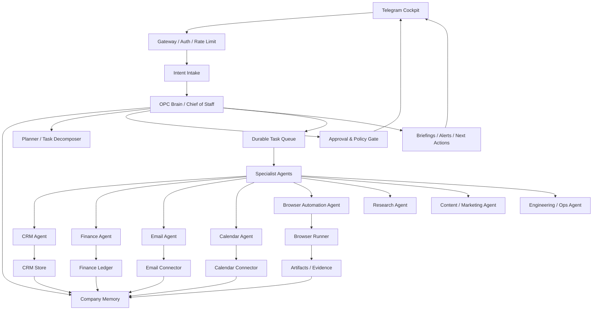
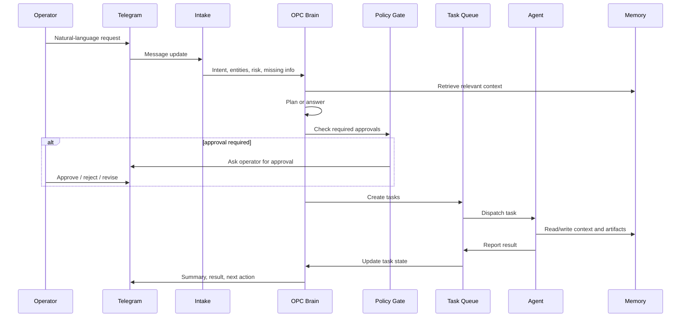

# Tele-OPC OS V2 Long-Term Plan

Telegram-first One-Person Company Operating System

## Status

This document is the execution source of truth for V2. Future design, code, tests, and documentation should align with this plan unless the plan is explicitly updated.

## Mission

Tele-OPC OS V2 turns Telegram into the cockpit for a one-person company. The system should help one operator run sales, research, content, product, engineering, finance, email, calendar, and browser-based workflows through a coordinated set of AI agents with persistent memory, task tracking, approvals, and audit logs.

The goal is not to make a chatbot. The goal is to build a small company operating system that can understand intent, plan work, execute safely, request approvals, learn from outcomes, and keep the founder informed.

## North Star

One person should be able to open Telegram and ask:

> What needs my attention today?

Tele-OPC OS should answer with the state of the business, not just a chat response:

- urgent customer follow-ups
- pending approvals
- blocked tasks
- finance risks
- meetings and preparation notes
- research or content opportunities
- browser automation results
- recommended next actions

## Product Definition

Tele-OPC OS V2 is composed of:

- Telegram Cockpit
- Gateway and authorization layer
- Intent Intake
- OPC Brain / Chief of Staff Orchestrator
- Planner and task decomposer
- Approval and policy gate
- Durable task queue
- Company memory
- Specialist agents
- Tool and connector layer
- Artifact workspace
- Review and learning loop
- Daily and weekly briefings

## Non-Goals

V2 must not:

- send external messages without approval
- make payments without approval
- modify production systems without approval
- replace legal, tax, accounting, or regulated professional judgment
- hide agent actions from the operator
- treat chat history as the only memory source
- give every agent all available tools

## System Architecture

## Operating Principles

1. The operator remains the final authority.
2. Every meaningful request becomes a tracked task or a logged answer.
3. External-world actions require explicit approval.
4. Memory must be structured, searchable, and auditable.
5. Agents receive the smallest useful permission set.
6. Tool calls must create evidence: logs, artifacts, screenshots, or summaries.
7. The system should explain why it recommends a next action.
8. Repeated work should become a playbook.
9. Completed work should feed the review loop.
10. The operator should be able to inspect, pause, retry, or cancel work.

## Core Workflow

## Task Lifecycle

Every task should move through a durable lifecycle:

- `new`
- `intake`
- `planned`
- `waiting_approval`
- `queued`
- `running`
- `waiting_external`
- `blocked`
- `review`
- `done`
- `cancelled`
- `failed`

Each task should include:

- task id
- title
- origin message
- owner agent
- priority
- due date
- risk level
- required approvals
- dependencies
- current status
- artifacts
- audit log
- final result

## Approval Policy

The system may do low-risk analysis automatically, but must request approval for actions that affect external systems, customers, finances, production data, or public content.

### Always Requires Approval

- sending email
- sending Telegram or social messages to customers
- creating, editing, or cancelling calendar invites with external people
- making payments, refunds, transfers, or subscription cancellations
- submitting web forms
- publishing website, blog, or social content
- changing production code or production data
- deleting records, files, messages, or financial data
- sharing files externally

### Usually Safe Without Approval

- reading allowed data sources
- summarizing email
- drafting messages
- creating internal notes
- analyzing CRM or finance data
- preparing calendar suggestions
- browsing public pages
- taking screenshots
- writing internal reports

## Memory Architecture

Memory should not be one undifferentiated chat log. Use layered memory:

### Strategic Memory

- company mission
- active goals
- positioning
- product strategy
- pricing assumptions
- market thesis

### Operational Memory

- current projects
- task history
- playbooks
- recurring routines
- blocked items
- decision records

### Relationship Memory

- contacts
- organizations
- leads
- customers
- interaction history
- promised follow-ups
- objections and preferences

### Financial Memory

- income
- expenses
- subscriptions
- invoices
- cash-flow forecast
- budget rules

### Personal Preference Memory

- writing style
- risk tolerance
- working hours
- approval preferences
- meeting preferences
- communication tone

## Specialist Agents

### Chief of Staff Agent

Primary coordinator. Responsible for:

- interpreting requests
- deciding whether to answer, plan, or delegate
- maintaining priorities
- checking task state
- preparing briefings
- coordinating cross-agent workflows
- asking for approvals

Permissions:

- read global memory
- create tasks
- inspect task state
- request approvals
- send Telegram notifications to the operator

Restrictions:

- does not directly send customer emails
- does not execute shell commands
- does not make financial transactions
- does not submit browser forms

### CRM Agent

Responsible for:

- contact and organization profiles
- lead scoring
- pipeline stage recommendations
- follow-up planning
- relationship summaries
- customer segmentation
- sales opportunity tracking

Data it owns:

- contacts
- organizations
- opportunities
- interactions
- follow-ups
- objections
- customer notes

High-risk actions:

- changing major pipeline stages
- sending customer messages
- deleting contact data

### Finance Agent

Responsible for:

- income and expense categorization
- subscription tracking
- invoice status
- cash-flow forecast
- financial briefing
- budget warnings
- renewal and cancellation suggestions

Data it owns:

- transactions
- invoices
- subscriptions
- budgets
- revenue records
- vendor records

High-risk actions:

- payment
- refund
- invoice sending
- subscription cancellation
- financial record deletion

### Email Agent

Responsible for:

- inbox triage
- thread summaries
- draft replies
- follow-up detection
- attachment summaries
- customer email context for CRM

High-risk actions:

- sending email
- forwarding email
- deleting email
- adding external recipients
- sending attachments

### Calendar Agent

Responsible for:

- daily schedule summary
- free/busy analysis
- meeting preparation
- agenda drafting
- reminder planning
- time-blocking suggestions

High-risk actions:

- creating external meetings
- moving external meetings
- cancelling meetings
- inviting new participants

### Browser Automation Agent

Responsible for:

- public web research
- dashboard inspection
- screenshot collection
- form preparation
- repetitive web workflows
- structured extraction from pages

Execution should use Playwright or a controlled browser runner.

High-risk actions:

- submitting forms
- publishing content
- deleting remote data
- changing account settings
- making purchases
- changing billing settings

Browser runs must save:

- target URL
- objective
- steps performed
- screenshots where useful
- extracted data
- final summary
- actions that were blocked pending approval

### Research Agent

Responsible for:

- market research
- competitor monitoring
- source collection
- report writing
- trend detection

High-risk actions:

- none by default, unless connected to external publishing.

### Content and Marketing Agent

Responsible for:

- brand voice
- article drafts
- social drafts
- email campaign drafts
- landing page copy
- campaign planning

High-risk actions:

- publishing
- sending campaigns
- editing public production content

### Engineering and Ops Agent

Responsible for:

- internal scripts
- repository analysis
- automation code
- data processing
- deployment preparation
- system health checks

High-risk actions:

- production deploy
- production database writes
- destructive file operations
- secret handling

## Connector Plan

### CRM Connector

V2 may start with an internal CRM database. Later, it can integrate with external systems.

Minimum capabilities:

- create contact
- update contact
- log interaction
- create opportunity
- update opportunity stage
- list follow-ups
- summarize account

### Finance Connector

V2 may start with an internal ledger. Later, it can integrate with Stripe, bank exports, accounting tools, or spreadsheets.

Minimum capabilities:

- import transaction
- categorize transaction
- track invoice
- track subscription
- forecast cash flow
- generate finance briefing

### Email Connector

Initial target:

- Gmail or IMAP

Minimum capabilities:

- read recent email metadata
- fetch selected thread
- classify email
- draft reply
- detect follow-up
- create send approval

### Calendar Connector

Initial target:

- Google Calendar or Outlook Calendar

Minimum capabilities:

- read events
- find availability
- draft event
- create event after approval
- prepare daily schedule

### Browser Connector

Initial target:

- Playwright controlled browser

Minimum capabilities:

- open URL
- extract text
- click and type in controlled runs
- take screenshot
- create pending approval before submit
- store browser run log

## Data Model Roadmap

Core tables or collections:

- `users`
- `telegram_chats`
- `conversations`
- `messages`
- `tasks`
- `task_events`
- `approvals`
- `agents`
- `agent_runs`
- `tool_calls`
- `artifacts`
- `memories`
- `playbooks`
- `briefings`
- `audit_logs`

CRM tables:

- `contacts`
- `organizations`
- `opportunities`
- `interactions`
- `follow_ups`
- `customer_segments`

Finance tables:

- `transactions`
- `invoices`
- `subscriptions`
- `budgets`
- `vendors`
- `cashflow_snapshots`

Email and calendar tables:

- `email_accounts`
- `email_threads`
- `email_drafts`
- `calendar_accounts`
- `calendar_events`
- `meeting_notes`

Browser automation tables:

- `browser_sessions`
- `browser_runs`
- `browser_steps`
- `browser_screenshots`
- `browser_extractions`

## Telegram UX

The system should support both natural language and concise commands.

### Core Commands

- `/start` - connect and verify the operator
- `/today` - show the daily command center
- `/tasks` - list active tasks
- `/task <id>` - inspect one task
- `/approve <id>` - approve a pending action
- `/reject <id>` - reject a pending action
- `/briefing` - generate a business briefing
- `/crm` - show CRM dashboard
- `/finance` - show finance dashboard
- `/mail` - show email triage
- `/calendar` - show schedule
- `/browser` - show browser automation dashboard
- `/ops` - show operations and governance dashboard
- `/healthcheck` - check integration health
- `/eval` - run the governance evaluation suite
- `/retry <task_id>` - retry a failed or blocked task
- `/audit_export [limit]` - export recent audit logs
- `/backup [row_limit]` - create a local backup
- `/memory` - inspect or update company memory
- `/settings` - configure preferences

### Inline Buttons

Messages should include buttons where useful:

- approve
- reject
- revise
- pause
- retry
- assign
- show details
- save to memory
- convert to task
- schedule follow-up

## Briefing System

### Daily Briefing

The daily briefing should include:

- top priorities
- calendar summary
- pending approvals
- blocked tasks
- urgent CRM follow-ups
- email requiring attention
- finance alerts
- completed overnight work
- recommended next actions

### Weekly Review

The weekly review should include:

- completed work
- missed tasks
- revenue and cash-flow summary
- pipeline movement
- content output
- system failures
- repeated bottlenecks
- suggested playbook updates

## Review and Learning Loop

Every completed task should produce a review record:

- what was requested
- what was done
- what artifacts were created
- whether approval was needed
- whether the result met the objective
- what should change next time
- whether memory or a playbook should be updated

This turns repeated work into operating leverage.

## Implementation Roadmap

### Phase 0: Planning and Product Contract

Deliverables:

- V2 long-term plan
- README usage guide
- initial architecture decisions
- first milestone scope

Acceptance criteria:

- system scope is clear
- safety rules are explicit
- future implementation can be judged against this document

### Phase 1: Core OPC Foundation

Deliverables:

- Telegram gateway
- operator allowlist
- message ingestion
- task database
- approval database
- basic OPC Brain
- daily briefing skeleton

Acceptance criteria:

- operator can talk to the system in Telegram
- messages become tasks or answers
- approvals can be requested and resolved
- active tasks can be listed

### Phase 2: Memory and Planning

Deliverables:

- structured memory store
- memory retrieval
- task decomposition
- priority scoring
- review logs
- playbook store

Acceptance criteria:

- system remembers company goals and preferences
- complex tasks can be decomposed
- completed work updates review history

### Phase 3: CRM and Email

Deliverables:

- internal CRM store
- CRM Agent
- email connector
- Email Agent
- contact and thread linking
- follow-up detection

Acceptance criteria:

- system can summarize customer state
- system can draft email replies
- system can create follow-up tasks
- sending email requires approval

### Phase 4: Finance and Calendar

Deliverables:

- internal finance ledger
- Finance Agent
- calendar connector
- Calendar Agent
- daily schedule briefing
- cash-flow briefing

Acceptance criteria:

- system can summarize finances
- system can flag subscriptions and invoices
- system can prepare meetings
- calendar writes require approval

### Phase 5: Browser Automation

Deliverables:

- browser runner
- Browser Automation Agent
- browser run logs
- screenshot artifacts
- submit-action approval gate

Acceptance criteria:

- system can inspect web dashboards
- system can extract structured data
- system pauses before external submissions
- browser runs are auditable

### Phase 6: Reliability and Governance

Deliverables:

- retries
- failure recovery
- rate limits
- audit export
- permission profiles
- integration health checks
- evaluation suite

Acceptance criteria:

- failed tasks are visible and recoverable
- dangerous actions are blocked by default
- operator can audit system behavior

## V2 Success Metrics

Operational metrics:

- daily active tasks created
- tasks completed per week
- average time from request to plan
- approval turnaround time
- blocked task count
- task failure rate

Business metrics:

- customer follow-ups completed
- pipeline movement
- invoices collected
- subscription waste detected
- content shipped
- meetings prepared

Quality metrics:

- operator corrections per task
- approval rejection rate
- repeated mistake count
- useful briefing score
- memory retrieval accuracy

## Risk Register

### Over-Automation

Risk: the system acts too aggressively.

Mitigation:

- approval gate
- default read-only connectors
- explicit high-risk action list

### Memory Pollution

Risk: incorrect or low-quality data becomes memory.

Mitigation:

- memory writes require source metadata
- important memory changes are reviewable
- playbooks are versioned

### Tool Misuse

Risk: an agent uses tools outside its domain.

Mitigation:

- least-privilege tool grants
- tool-call audit logs
- per-agent permission profiles

### Browser Automation Mistakes

Risk: browser automation clicks or submits the wrong thing.

Mitigation:

- dry-run mode
- screenshot evidence
- submit approval
- domain allowlists

### Finance Errors

Risk: finance summaries are wrong or incomplete.

Mitigation:

- distinguish imported facts from inferred categorization
- keep source references
- require approval for money movement

## Implementation Rule

When implementation begins, every feature should answer:

1. Which operator problem does this solve?
2. Which agent owns it?
3. What data does it read?
4. What data does it write?
5. What approval policy applies?
6. What artifact or audit log proves what happened?
7. How will the result improve future behavior?

If a feature cannot answer these questions, it should not enter V2.
