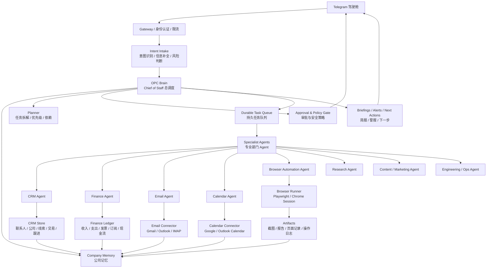
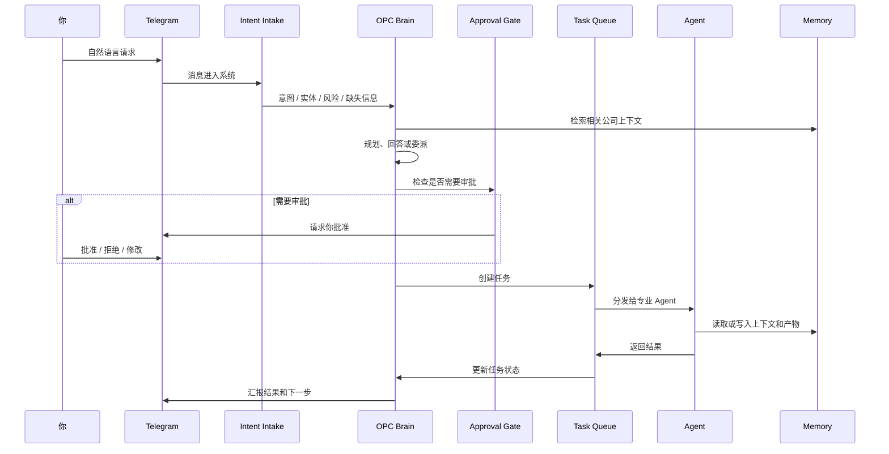

# Tele-OPC OS V2 长期计划

Telegram-first One-Person Company Operating System

中文：Telegram 优先的一人公司操作系统

## 文档状态

本文档是 Tele-OPC OS V2 的长期执行准绳。后续架构设计、代码实现、测试、文档和产品决策，都应该以本文档为基准。除非明确更新本文档，否则不要偏离这里定义的系统目标和安全边界。

英文版见：[V2_LONG_TERM_PLAN.md](./V2_LONG_TERM_PLAN.md)

工程实施顺序见：[V2_IMPLEMENTATION_ROADMAP.zh-CN.md](./V2_IMPLEMENTATION_ROADMAP.zh-CN.md)

## 使命

Tele-OPC OS V2 的目标，是把 Telegram 变成一人公司的移动驾驶舱。

它不是一个简单聊天机器人，而是一个可以帮助一个人经营公司的操作系统：

- 理解你的业务意图
- 拆解复杂任务
- 分配给不同专业 Agent
- 追踪任务状态
- 管理客户关系
- 管理财务和订阅
- 阅读和起草邮件
- 安排和准备日程
- 执行浏览器自动化
- 在高风险动作前请求你批准
- 每天和每周给你经营简报
- 从复盘中学习你的偏好和公司流程

## 北极星目标

你每天打开 Telegram，只需要问：

> 今天公司有什么需要我处理？

系统应该回答的是“公司状态”，而不是普通聊天回复：

- 哪些客户该跟进
- 哪些任务卡住了
- 哪些邮件需要处理
- 哪些账单或发票有风险
- 今天有哪些会议
- 会议前需要准备什么
- 哪些内容或销售机会值得推进
- 浏览器自动化跑出了什么结果
- 哪些动作需要你批准
- 今天最应该做的 3 件事是什么

## 产品定义

Tele-OPC OS V2 由以下部分组成：

- Telegram 驾驶舱
- Gateway / 身份认证 / 限流层
- Intent Intake 意图理解层
- OPC Brain / Chief of Staff 总调度
- Planner 任务规划器
- Approval & Policy Gate 审批和策略门
- Durable Task Queue 持久任务队列
- Company Memory 公司记忆
- Specialist Agents 专业 Agent
- Tool / Connector Layer 工具和连接器层
- Artifact Workspace 产物工作区
- Review Loop 复盘学习回路
- Daily / Weekly Briefing 日报和周报

## 非目标

V2 不应该做这些事：

- 未经批准自动给客户发消息
- 未经批准自动付款、退款或取消订阅
- 未经批准修改生产系统
- 替代法律、税务、会计等专业判断
- 隐藏 Agent 做了什么
- 只把聊天记录当作记忆
- 给所有 Agent 开放全部权限
- 为了“自动化”牺牲可审计性和安全边界

## 总体架构

## 运行原则

1. 人是最终决策者。
2. 重要请求必须变成可追踪任务，或形成可记录答案。
3. 所有外部世界动作必须经过审批。
4. 公司记忆必须结构化、可搜索、可审计。
5. 每个 Agent 只拿完成职责所需的最小权限。
6. 工具调用必须留下证据：日志、截图、产物或摘要。
7. 系统必须说明为什么推荐某个下一步动作。
8. 重复工作应该沉淀成 playbook。
9. 完成的任务必须进入复盘回路。
10. 你可以随时查看、暂停、重试、取消任务。

## 核心工作流

## 任务生命周期

每个任务都应该进入持久状态机：

- `new`：新任务
- `intake`：意图理解中
- `planned`：已规划
- `waiting_approval`：等待你审批
- `queued`：已进入队列
- `running`：执行中
- `waiting_external`：等待外部反馈
- `blocked`：被阻塞
- `review`：复盘中
- `done`：完成
- `cancelled`：取消
- `failed`：失败

每个任务至少包含：

- 任务 ID
- 标题
- 原始消息
- 负责人 Agent
- 优先级
- 截止时间
- 风险等级
- 所需审批
- 依赖任务
- 当前状态
- 产物链接
- 审计日志
- 最终结果

## 审批策略

系统可以自动读取、分析、起草、整理低风险内容，但凡是会影响客户、财务、外部系统、公开内容或生产环境的动作，都必须请求你批准。

### 必须审批的动作

- 发送邮件
- 给客户发送 Telegram、短信或社媒消息
- 创建、修改、取消外部会议邀请
- 付款、退款、转账、取消订阅
- 提交网页表单
- 发布网站、博客、社媒内容
- 部署生产代码
- 修改生产数据
- 删除记录、文件、邮件、财务数据
- 对外分享附件或文件

### 默认可自动执行的动作

- 读取已授权数据
- 总结邮件
- 起草回复
- 创建内部笔记
- 分析 CRM 数据
- 分析财务数据
- 准备日程建议
- 浏览公开网页
- 截图留证
- 写内部报告

## 公司记忆架构

公司记忆不能只是聊天历史。V2 应该使用分层记忆。

### 战略记忆

- 公司使命
- 当前目标
- 产品定位
- 价格假设
- 市场判断
- 长期策略

### 运营记忆

- 当前项目
- 任务历史
- playbook
- 周期性流程
- 阻塞项
- 决策记录

### 关系记忆

- 联系人
- 公司
- 线索
- 客户
- 沟通历史
- 承诺的跟进
- 客户异议和偏好

### 财务记忆

- 收入
- 支出
- 订阅
- 发票
- 现金流预测
- 预算规则

### 个人偏好记忆

- 写作风格
- 风险偏好
- 工作时间
- 审批偏好
- 会议偏好
- 沟通语气

## 专业 Agent 设计

### Chief of Staff Agent

公司总调度。负责：

- 理解你的请求
- 判断是回答、规划还是委派
- 维护优先级
- 查询任务状态
- 准备日报和周报
- 协调跨 Agent 工作流
- 请求审批

权限：

- 读取全局记忆
- 创建任务
- 查看任务状态
- 请求审批
- 给你发送 Telegram 通知

限制：

- 不直接给客户发邮件
- 不执行 shell 命令
- 不进行财务交易
- 不提交浏览器表单

### CRM Agent

负责：

- 联系人和公司档案
- 线索评分
- 销售机会管理
- 跟进计划
- 客户关系摘要
- 客户分层
- 销售管道变化

拥有的数据：

- contacts 联系人
- organizations 公司
- opportunities 机会
- interactions 互动
- follow_ups 跟进
- objections 异议
- customer notes 客户笔记

高风险动作：

- 修改关键销售阶段
- 给客户发消息
- 删除客户数据

### Finance Agent

负责：

- 收入和支出分类
- 订阅管理
- 发票状态
- 现金流预测
- 财务简报
- 预算提醒
- 续费和取消建议

拥有的数据：

- transactions 交易
- invoices 发票
- subscriptions 订阅
- budgets 预算
- vendors 供应商
- revenue records 收入记录

高风险动作：

- 付款
- 退款
- 发送发票
- 取消订阅
- 删除财务记录

### Email Agent

负责：

- 收件箱分类
- 邮件线程摘要
- 起草回复
- 识别待跟进邮件
- 总结附件
- 把邮件上下文关联到 CRM

高风险动作：

- 发送邮件
- 转发邮件
- 删除邮件
- 增加外部收件人
- 发送附件

### Calendar Agent

负责：

- 日程摘要
- 空闲时间分析
- 冲突检测
- 会议准备
- 议程草稿
- 时间块建议

高风险动作：

- 创建外部会议
- 移动外部会议
- 取消会议
- 邀请新参会人

### Browser Automation Agent

负责：

- 公开网页研究
- 后台看板检查
- 页面截图
- 表单准备
- 重复网页操作
- 从页面提取结构化数据

浏览器自动化建议使用 Playwright 或可控 Chrome session。

高风险动作：

- 提交表单
- 发布内容
- 删除远程数据
- 修改账户设置
- 购买或付款
- 修改账单设置

每次浏览器运行必须保存：

- 目标 URL
- 任务目标
- 执行步骤
- 必要截图
- 提取的数据
- 最终总结
- 被审批门拦住的动作

### Research Agent

负责：

- 市场研究
- 竞品监控
- 来源收集
- 报告写作
- 趋势发现

默认高风险动作：

- 无。除非接入外部发布工具。

### Content / Marketing Agent

负责：

- 品牌语气
- 文章草稿
- 社媒草稿
- 邮件活动草稿
- 落地页文案
- 营销活动规划

高风险动作：

- 发布
- 发送营销活动
- 修改公开生产内容

### Engineering / Ops Agent

负责：

- 内部脚本
- 仓库分析
- 自动化代码
- 数据处理
- 部署准备
- 系统健康检查

高风险动作：

- 生产部署
- 生产数据库写入
- 破坏性文件操作
- secret 处理

## 连接器计划

### CRM Connector

V2 初期可以先使用内部 CRM 数据库，后续再接外部 CRM。

最小能力：

- 创建联系人
- 更新联系人
- 记录互动
- 创建销售机会
- 更新机会阶段
- 列出待跟进事项
- 总结客户账户

### Finance Connector

V2 初期可以先使用内部财务台账，后续接 Stripe、银行流水、会计工具或表格。

最小能力：

- 导入交易
- 分类交易
- 跟踪发票
- 跟踪订阅
- 预测现金流
- 生成财务简报

### Email Connector

初期目标：

- Gmail 或 IMAP

最小能力：

- 读取近期邮件元信息
- 获取指定邮件线程
- 邮件分类
- 起草回复
- 识别跟进
- 创建发送审批

### Calendar Connector

初期目标：

- Google Calendar 或 Outlook Calendar

最小能力：

- 读取日程
- 查找空闲时间
- 起草日程事件
- 审批后创建事件
- 生成每日安排

### Browser Connector

初期目标：

- Playwright 控制浏览器

最小能力：

- 打开 URL
- 提取文本
- 在受控环境中点击和输入
- 截图
- 提交前创建审批
- 保存浏览器运行日志

## 数据模型路线图

核心数据：

- `users`
- `telegram_chats`
- `conversations`
- `messages`
- `tasks`
- `task_events`
- `approvals`
- `agents`
- `agent_runs`
- `tool_calls`
- `artifacts`
- `memories`
- `playbooks`
- `briefings`
- `audit_logs`

CRM 数据：

- `contacts`
- `organizations`
- `opportunities`
- `interactions`
- `follow_ups`
- `customer_segments`

财务数据：

- `transactions`
- `invoices`
- `subscriptions`
- `budgets`
- `vendors`
- `cashflow_snapshots`

邮件和日历数据：

- `email_accounts`
- `email_threads`
- `email_drafts`
- `calendar_accounts`
- `calendar_events`
- `meeting_notes`

浏览器自动化数据：

- `browser_sessions`
- `browser_runs`
- `browser_steps`
- `browser_screenshots`
- `browser_extractions`

## Telegram 交互设计

系统应该支持自然语言，也支持少量高频命令。

### 核心命令

- `/start`：连接系统并验证身份
- `/today`：查看今天的公司控制台
- `/tasks`：查看活跃任务
- `/task <id>`：查看单个任务
- `/approve <id>`：批准待审批动作
- `/reject <id>`：拒绝待审批动作
- `/briefing`：生成经营简报
- `/crm`：查看 CRM 看板
- `/finance`：查看财务看板
- `/mail`：查看邮件分拣结果
- `/calendar`：查看日程
- `/browser`：查看浏览器自动化看板
- `/ops`：查看运维治理看板
- `/healthcheck`：检查集成健康状态
- `/eval`：运行治理评估套件
- `/retry <task_id>`：重试失败或阻塞任务
- `/audit_export [limit]`：导出最近审计日志
- `/backup [row_limit]`：创建本地备份
- `/memory`：查看或更新公司记忆
- `/settings`：设置偏好和集成

### Telegram 按钮

必要时消息应该带按钮：

- 批准
- 拒绝
- 修改
- 暂停
- 重试
- 分配
- 查看详情
- 保存到记忆
- 转成任务
- 安排跟进

## 简报系统

### 每日简报

每日简报应该包括：

- 今日最高优先级
- 日程摘要
- 待审批事项
- 阻塞任务
- 紧急客户跟进
- 需要处理的邮件
- 财务提醒
- 昨晚完成的工作
- 推荐下一步动作

### 每周复盘

每周复盘应该包括：

- 已完成工作
- 错过的任务
- 收入和现金流摘要
- 销售管道变化
- 内容产出
- 系统失败记录
- 反复出现的瓶颈
- 推荐更新的 playbook

## 复盘和学习回路

每个完成任务都应该生成复盘记录：

- 原始请求是什么
- 实际做了什么
- 产出了哪些文件或证据
- 是否需要审批
- 结果是否达成目标
- 下次应该怎么改
- 是否应该更新记忆或 playbook

这样系统会随着你的使用越来越像你的公司。

## 实现路线图

### Phase 0：规划和产品契约

交付物：

- V2 长期计划
- README 使用指南
- 初始架构决策
- 第一阶段范围

验收标准：

- 系统范围清楚
- 安全规则明确
- 后续实现可按本文档验收

### Phase 1：OPC 核心基础

交付物：

- Telegram Gateway
- 运营者 allowlist
- 消息接入
- 任务数据库
- 审批数据库
- 基础 OPC Brain
- 每日简报骨架

验收标准：

- 你可以在 Telegram 中和系统对话
- 消息可以变成任务或答案
- 审批可以创建和完成
- 可以查看活跃任务

### Phase 2：记忆和规划

交付物：

- 结构化记忆
- 记忆检索
- 任务拆解
- 优先级评分
- 复盘日志
- playbook 存储

验收标准：

- 系统记得公司目标和个人偏好
- 复杂任务可以拆解
- 完成任务后能写入复盘历史

### Phase 3：CRM 和邮件

交付物：

- 内部 CRM
- CRM Agent
- 邮件连接器
- Email Agent
- 联系人和邮件线程关联
- 跟进检测

验收标准：

- 系统可以总结客户状态
- 系统可以起草邮件回复
- 系统可以创建跟进任务
- 邮件发送必须审批

### Phase 4：财务和日历

交付物：

- 内部财务台账
- Finance Agent
- 日历连接器
- Calendar Agent
- 日程简报
- 现金流简报

验收标准：

- 系统可以总结财务状态
- 系统可以提醒订阅和发票风险
- 系统可以准备会议
- 日历写入必须审批

### Phase 5：浏览器自动化

交付物：

- Browser Runner
- Browser Automation Agent
- 浏览器运行日志
- 截图产物
- 提交动作审批门

验收标准：

- 系统可以检查网页后台
- 系统可以提取结构化数据
- 提交外部动作前会暂停等待审批
- 浏览器运行可审计

### Phase 6：可靠性和治理

交付物：

- 重试机制
- 失败恢复
- 限流
- 审计导出
- 权限配置
- 集成健康检查
- 评估套件

验收标准：

- 失败任务可见且可恢复
- 危险动作默认被拦截
- 你可以审计系统行为

## V2 成功指标

运营指标：

- 每日创建任务数
- 每周完成任务数
- 从请求到计划的平均时间
- 审批响应时间
- 阻塞任务数量
- 任务失败率

业务指标：

- 已完成客户跟进数
- 销售管道推进数
- 收回发票金额
- 发现的订阅浪费
- 发布的内容数量
- 准备的会议数量

质量指标：

- 每个任务需要你纠正的次数
- 审批拒绝率
- 重复错误数量
- 简报有用度
- 记忆检索准确度

## 风险登记

### 过度自动化

风险：系统过于主动，做了不该做的事。

缓解：

- 审批门
- 默认只读连接器
- 明确高风险动作列表

### 记忆污染

风险：错误信息进入长期记忆。

缓解：

- 记忆写入必须有来源
- 重要记忆变更可审查
- playbook 需要版本化

### 工具误用

风险：Agent 使用了不属于自己职责的工具。

缓解：

- 最小权限
- 工具调用审计
- 每个 Agent 独立权限配置

### 浏览器自动化错误

风险：自动化误点、误提交。

缓解：

- dry-run 模式
- 截图证据
- 提交前审批
- 域名 allowlist

### 财务错误

风险：财务总结错误或不完整。

缓解：

- 区分导入事实和模型推断
- 保留来源引用
- 资金动作必须审批

## 实现规则

开始实现后，每个功能都必须回答：

1. 它解决了你的哪个运营问题？
2. 哪个 Agent 负责？
3. 读取哪些数据？
4. 写入哪些数据？
5. 适用什么审批策略？
6. 有什么产物或审计日志证明发生了什么？
7. 结果如何改进未来行为？

如果一个功能回答不了这些问题，就不应该进入 V2。
