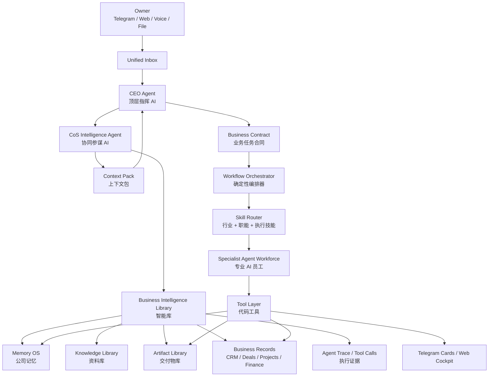

# V4 OPC Business OS 架构方案

> Draft v0.3  
> 项目：Tele-OPC OS  
> 定位：Telegram-first, AI-native One-Person Company Business Operating System  
> 修订重点：AI Agent 不是被削弱，而是升级为顶层指挥链。业务对象是经营骨架，AI Command Spine 是智能中枢，工具层是可审计执行器。

## 0. 这版先纠偏

上一版方向对了一半：它把 Tele-OPC 从“多 Agent 聊天机器人”拉回到“一人公司经营系统”，但表达上容易造成一个误解：好像业务系统变成中心以后，AI Agent 就只是附属功能。

正确版本应该是：

```text
OPC Business OS 是公司经营骨架。
AI Command Spine 是所有经营动作的智能中枢。
CoS Intelligence Agent + Business Intelligence Library 是顶层 AI 指挥时必须依赖的大脑。
Specialist Agents 是数字员工。
Tool Layer 是这些员工能安全使用的工具和账本。
```

也就是说：

- 业务系统定义公司真实对象：客户、线索、项目、报价、发票、交付物、记忆。
- 顶层 AI 负责理解老板目标、组织协作、生成业务合同、决定下一步。
- 协同 AI 负责检索智能库、补上下文、发现冲突、给顶层 AI 做参谋。
- 专业 Agent 负责销售、报价、交付、内容、财务、浏览器、开发等具体岗位。
- 工具层用代码实现，但只实现可靠动作，不把业务智能写死在代码里。

一句话：

> Tele-OPC V4 不是弱 AI 的业务后台，也不是无业务对象的 Agent 群聊，而是“顶层 AI 指挥的一人公司经营操作系统”。

## 1. 外部 OPC 参考带来的设计约束

这次参考不能只看 Agent 框架，要看一人公司怎么真实运营。参考方向和落到系统里的约束如下。

### 1.1 One-person company / operator 模型

Taskade 的 one-person company 文章有一个很关键的判断：一人公司不是一个人做所有工作，而是一个 operator 指挥 AI agents、automations 和专业工具执行，老板保留 strategy、quality 和 customer relationships。  
参考：[Taskade - One-Person Companies](https://www.taskade.com/blog/one-person-companies)

落到 Tele-OPC：

- Owner 不应该亲自搬运任务、复制文件、追状态。
- Owner 只负责目标、质量、客户关系、关键审批。
- CEO Agent 必须是最高智能入口，而不是 Web 或 Telegram 里的一个可选助手。
- Agent 要能调工具、查资料、生成交付物、沉淀记忆，而不是只回复聊天文本。

### 1.2 Freelancer / one-person business management 产品

Plutio 的定位是一个 app run, grow, and automate your business，功能覆盖 clients、projects、forms、bookings、proposals、payments、workflow automation。  
参考：[Plutio](https://www.plutio.com/) 和 [Plutio features](https://www.plutio.com/features)

Moxie / HoneyBook 这类自由职业和小业务工具也都把 clients、projects、proposals、contracts、invoices、payments 放在同一个客户经营流里。  
参考：[Moxie](https://www.withmoxie.com/)、[HoneyBook](https://www.honeybook.com/)

落到 Tele-OPC：

- CRM 不能只是联系人表。
- Project 不能只是任务列表。
- Deal 不能只是报价文本。
- Finance 不能只是记账。
- 所有页面都要围绕“获客 -> 成交 -> 交付 -> 收款 -> 复盘 -> 复用”闭环。

### 1.3 SOP / systems for solopreneurs

一人公司更需要 SOP，因为没有团队冗余，流程错误会直接吃掉老板时间。SOP 的价值不是文档好看，而是让交付可重复、检查可追踪、资产可复用。

落到 Tele-OPC：

- Memory OS 必须管理 SOP、报价规则、客户禁忌、品牌规则、服务包。
- Library 必须管理资料、模板、网页证据、客户文件。
- Artifact Library 必须保存每次生成的 PPT、网页、文档、代码、邮件、报告，并支持版本和复用。
- CoS Intelligence Agent 每次规划前必须检索这些内容，不能让 CEO Agent 凭空想。

## 2. V4 总定位

Tele-OPC V4 是：

> 一个 Telegram-first 的 AI-native 一人公司经营操作系统。它帮助 Owner 获客、成交、交付、记账、沉淀资产、复盘增长。Owner 是决策者，CEO Agent 是运营指挥官，CoS Intelligence Agent 是参谋部，Specialist Agents 是数字员工，工具层是可审计执行器。

系统闭环：

```text
输入机会
  -> CEO Agent 判断经营目标
  -> CoS Intelligence Agent 检索智能库
  -> CEO Agent 生成 Business Contract
  -> Orchestrator 编排 StepRun
  -> Specialist Agents 执行
  -> Tool Layer 落库/发信/生成/查询/预览
  -> Artifact / Memory / Business Records 沉淀
  -> Telegram Card / Owner Cockpit 通知老板决策
```

## 3. 核心架构：AI Command Spine

V4 的核心不是“几个页面”，而是一条 AI Command Spine。



### 3.1 CEO Agent：顶层指挥 AI

CEO Agent 是所有入口的最高智能决策者。

职责：

- 理解 Owner 的真实经营意图，而不是关键词分类。
- 判断输入属于获客、销售、报价、交付、财务、资料、记忆、复盘、开发、研究还是普通问答。
- 召唤 CoS Intelligence Agent 构造 Context Pack。
- 基于上下文生成 Business Contract。
- 决定是否追问、是否先做 v0、是否需要审批。
- 指派 Specialist Agents，并规定每个 Agent 的职责边界。
- 决定结果展示方式：Telegram Card、Mini App、Web 详情页、下载文件。

CEO Agent 不直接做：

- 直接写数据库。
- 直接付款、退款、删除、对外发送高风险承诺。
- 把长 Markdown、HTML、PPT 正文或内部提示词刷到 Telegram。
- 绕过 CoS 上下文检索和审批策略。

### 3.2 CoS Intelligence Agent：协同参谋 AI

CoS 不是普通检索函数，而是顶层 AI 指挥时的参谋 AI。它靠 Business Intelligence Library 工作。

职责：

- 检索相关公司记忆、客户历史、报价规则、服务包、SOP、历史交付物、邮件、项目、财务记录。
- 发现冲突：新报价与旧报价规则冲突、客户信息与 CRM 冲突、交付承诺超出服务包。
- 给 CEO Agent 提供 Context Pack。
- 建议 Skill 组合和 Specialist Agents。
- 判断哪些新信息应该成为 MemoryCandidate。
- 给出风险提示和缺失输入，但不替 CEO 做最终指挥。

CoS 输出必须结构化：

```ts
interface ContextPack {
  requestId: string;
  querySummary: string;
  relevantMemories: ContextRef[];
  relevantArtifacts: ContextRef[];
  relevantLibraryItems: ContextRef[];
  relevantCustomers: ContextRef[];
  relevantDeals: ContextRef[];
  relevantProjects: ContextRef[];
  relevantFinanceItems: ContextRef[];
  ownerPreferences: string[];
  pricingRules: string[];
  servicePackages: string[];
  sopCandidates: string[];
  conflicts: ConflictNote[];
  missingInputs: string[];
  recommendedSkills: string[];
  recommendedAgents: string[];
  riskNotes: RiskNote[];
}

interface ContextRef {
  objectType: string;
  objectId: string;
  title: string;
  summary: string;
  relevance: number;
  source: string;
}
```

### 3.3 Specialist Agent Workforce：数字员工

专业 Agent 是员工，不是老板。它们接受 Business Contract 和 Context Pack 执行岗位任务。

- Sales Agent：ICP、线索、客户画像、跟进建议、触达草稿。
- Deal Agent：服务包匹配、报价草案、合同风险、成交下一步。
- Delivery Agent：项目拆解、里程碑、交付物验收、范围风险。
- Content Agent：PPT、网页、文档、邮件、报告。
- Finance Agent：收入、支出、发票、现金流预测、财务风险。
- Browser Agent：公开网页浏览、截图证据、网页资料入库。
- Dev Agent：代码、集成、部署、技术交付物。
- Memory Agent：记忆候选、冲突识别、SOP 候选。
- Ops Agent：复盘、流程健康、系统配置风险。

## 4. 工具层到底怎么实现

答案是：工具层必须用代码实现，但智能不应该硬编码在工具层。

### 4.1 正确分工

```text
AI 负责判断：
- 为什么做
- 做什么
- 调哪个工具
- 用哪些上下文
- 需要哪些审批
- 结果是否满足经营目标

代码工具负责执行：
- 参数 schema 校验
- 权限和审批拦截
- 幂等性
- 数据库落库
- 文件读写和预览生成
- 外部 API 调用
- 审计日志
- 结构化错误返回
```

工具层不是 if/else 业务大脑。工具层是“可被 AI 调用的稳定能力目录”。

### 4.2 Tool Registry 设计

```ts
interface ToolDefinition<Input, Output> {
  name: string;
  domain:
    | 'inbox'
    | 'crm'
    | 'deal'
    | 'project'
    | 'artifact'
    | 'library'
    | 'memory'
    | 'finance'
    | 'mail'
    | 'calendar'
    | 'browser'
    | 'agent';
  description: string;
  inputSchema: unknown;
  outputSchema: unknown;
  riskLevel: 'low' | 'medium' | 'high';
  approvalPolicy: 'never' | 'on_risk' | 'always';
  idempotencyKeyFields: string[];
  handler: (input: Input, ctx: ToolContext) => Promise<ToolResult<Output>>;
}

interface ToolResult<T> {
  ok: boolean;
  data?: T;
  blocked?: boolean;
  approvalRequired?: boolean;
  approvalId?: string;
  reason?: string;
  auditId: string;
  traceId: string;
}
```

### 4.3 Tool Call 生命周期

```text
Agent 提出 tool call
  -> Tool Registry 校验工具存在
  -> Zod/schema 校验输入
  -> PermissionPolicy 判断权限
  -> ApprovalPolicy 判断是否拦截
  -> handler 执行代码动作
  -> 写 tool_calls / audit_logs
  -> 返回结构化结果
  -> Orchestrator 更新 StepRun / Task / Artifact / Memory
```

当前项目已有 `agent_runs` 和 `tool_calls` 表，这是 V4 可以复用的地基。V4 要补的是：Tool Registry、Business Contract、Context Pack、StepRun 状态机、对象关联表。

### 4.4 例子：创建线索不是正则识别

```text
Owner: 帮我找深圳 20 家适合做小红书投放的轻食品牌

CEO Agent:
  判断这是 Demand Engine / prospecting 任务
  请求 CoS 检索 ICP、历史客户、禁忌、行业资料

CoS Agent:
  返回 Context Pack，包括过往报价、服务包、行业资料、客户偏好

Sales Agent:
  生成线索字段、评分模型、搜索策略、跟进话术

Browser Agent:
  查询公开网页，保存证据截图和网页快照

Tool Layer:
  createProspectingRun
  createLead
  scoreLead
  saveWebSnapshot
  scheduleFollowUp

Telegram:
  只发“线索挖掘任务卡”和“20 条线索预览入口”
```

## 5. Business Intelligence Library 智能库

智能库是 CoS Intelligence Agent 的大脑，不是网盘。

### 5.1 智能库组成

```text
Memory OS
  公司长期有效规则：定位、偏好、报价、服务包、SOP、客户禁忌、品牌规则

Knowledge Library
  上传资料、客户文件、网页快照、会议纪要、邮件资料、行业资料

Artifact Library
  系统生成的 PPT、网页、文档、代码、邮件草稿、报告、财务模型

Business Records
  Customer、Lead、Deal、Project、Task、Quote、Invoice、Email、CalendarEvent

Agent Trace
  AgentRun、ToolCall、审批、证据、引用来源
```

### 5.2 智能库必须支持

- 全文搜索：用于明确关键词、客户名、项目名。
- 语义搜索：用于“找类似报价、类似交付、相关 SOP”。
- 关系检索：客户 -> 项目 -> 交付物 -> 发票 -> 邮件 -> 记忆。
- 来源追踪：每条记忆和资料都能回到原始消息、文件、网页或 AgentRun。
- 版本历史：Artifact、Memory、SOP、报价规则必须版本化。
- 冲突检测：新规则和旧规则冲突时生成 MemoryConflict。
- 引用注入：给 Agent 的上下文必须包含来源 ID，不允许无来源幻觉。

### 5.3 Memory OS 状态

```text
candidate   候选，尚未生效
approved    老板批准，但可能未设为 active
active      当前生效
conflicted  与其他记忆冲突
deprecated  已废弃，但保留历史
expired     到期或上下文不再适用
```

Memory Agent 只能生成 candidate 或 conflict，不直接改 active。

## 6. 核心对象模型

V4 要从“任务中心”升级成“业务对象中心”。

```text
InboxItem
BusinessContract
Customer / Lead / Contact / Opportunity
Deal / Quote / Proposal / ServicePackage / PricingRule
Project / Milestone / Task / StepRun
Artifact / ArtifactVersion
LibraryItem / FileAsset / WebSnapshot
Memory / MemoryCandidate / MemoryConflict
Invoice / Transaction / Subscription / CashflowForecast
EmailThread / EmailDraft
CalendarEvent / FollowUp
AgentRun / ToolCall / TraceEvent
ShortCode
```

### 6.1 BusinessContract

所有入口最终都要转成 BusinessContract。

```ts
interface BusinessContract {
  id: string;
  sourceInboxItemId?: string;
  originalRequest: string;
  businessDomain:
    | 'demand'
    | 'deal'
    | 'delivery'
    | 'money'
    | 'memory'
    | 'asset'
    | 'ops'
    | 'dev'
    | 'question';
  primaryObjectType:
    | 'lead'
    | 'customer'
    | 'deal'
    | 'project'
    | 'task'
    | 'artifact'
    | 'memory'
    | 'invoice'
    | 'email'
    | 'calendar_event';
  goal: string;
  successCriteria: string[];
  assumptions: string[];
  contextPackId: string;
  selectedAgents: string[];
  selectedSkills: string[];
  plannedToolCalls: string[];
  delivery: DeliveryContract;
  risk: RiskContract;
  approvalRequirements: ApprovalRequirement[];
}
```

### 6.2 ShortCode

老板不记长 ID，只用短编号。

```ts
interface ShortCode {
  code: string; // T12, A7, M3, C15, D4, P8
  objectType: string;
  objectId: string;
  ownerUserId: string;
  createdAt: string;
}
```

### 6.3 Artifact

```ts
interface Artifact {
  id: string;
  shortCode: string;
  kind:
    | 'slide_deck'
    | 'html_page'
    | 'document'
    | 'code'
    | 'email_draft'
    | 'report'
    | 'finance_model';
  title: string;
  status: 'draft' | 'ready' | 'reviewing' | 'approved' | 'delivered' | 'archived';
  currentVersionId: string;
  customerId?: string;
  projectId?: string;
  taskId?: string;
  createdByAgentRunId: string;
  sourceMemoryIds: string[];
  sourceLibraryItemIds: string[];
  previewUrl?: string;
  downloadUrl?: string;
}
```

## 7. 推荐导航和功能落地

导航完整不是为了显得“大”，而是因为 OPC 的经营流天然需要这些系统。每个页面都必须回答一个经营问题，并且有对象、Agent、工具、MVP。

```text
/app/cockpit
/app/inbox
/app/tasks
/app/projects
/app/crm
/app/deals
/app/artifacts
/app/library
/app/memory
/app/finance
/app/mail
/app/calendar
/app/browser
/app/agents
/app/settings
```

### 7.1 页面实现矩阵

| 页面 | 经营问题 | 核心对象 | AI 实现 | 工具/API | 第一版 MVP |
| --- | --- | --- | --- | --- | --- |
| Cockpit | 今天先处理什么，哪里影响收入/交付/现金流 | Task, Project, Approval, FollowUp, Artifact, FinanceRisk | CEO 生成 Owner Brief，CoS 汇总全局上下文，Ops 给下一步建议 | `listTodayPriorities`, `listBlockedProjects`, `listPendingApprovals`, `listCashflowAlerts` | 今日优先事项、待审批、卡住项目、最近交付物、记忆候选 |
| Inbox | 所有输入如何进入系统 | InboxItem, Attachment, Classification | CEO 分类输入，CoS 查上下文，Memory Agent 判断记忆候选 | `createInboxItem`, `classifyInboxItem`, `convertInboxToContract`, `archiveInboxItem` | Telegram 文本/文件/语音入库，转 Contract 或 MemoryCandidate |
| Tasks | 当前执行到了哪一步 | Task, StepRun, Approval, AgentRun | Orchestrator 管状态，Specialist 执行步骤，CEO 只在重规划时介入 | `createTaskFromContract`, `advanceStep`, `retryStep`, `pauseTask`, `cancelTask` | Task 卡片、步骤时间线、Agent Trace |
| Projects | 客户交付是否按范围推进 | Project, Milestone, Task, Artifact, ScopeItem | Delivery Agent 拆计划，CoS 找 SOP/模板，Ops 识别范围风险 | `createProject`, `createMilestone`, `linkArtifactToProject`, `detectScopeRisk` | 项目列表、里程碑、交付物关联、阻塞原因 |
| CRM | 谁是客户，谁该跟进 | Lead, Customer, Contact, Opportunity, FollowUp | Sales Agent 画像和评分，CoS 查历史沟通和旧项目 | `createLead`, `scoreLead`, `createOpportunity`, `scheduleFollowUp` | 联系人、机会、今日跟进、线索评分 |
| Deals | 如何报价并成交 | ServicePackage, PricingRule, Quote, Proposal, Deal | Deal Agent 起草报价，Finance Agent 看现金流，CoS 查规则冲突 | `draftQuote`, `validateQuoteAgainstRules`, `createProposalArtifact`, `convertDealToProject` | 报价草案、规则校验、报价转项目 |
| Artifacts | 生成物如何预览、改版、复用 | Artifact, ArtifactVersion, Review, SourceReference | Content/Dev Agent 生成，Review Agent 检查，CoS 追踪来源 | `createArtifact`, `createArtifactVersion`, `renderArtifactPreview`, `duplicateArtifactAsTemplate` | 交付物库、预览、版本、来源追踪 |
| Library | 资料如何被 AI 使用 | LibraryItem, FileAsset, WebSnapshot, ParsedDocument | CoS 检索资料，Memory Agent 提取记忆，Specialist 引用资料 | `uploadLibraryItem`, `parseDocument`, `tagLibraryItem`, `searchLibrary` | 上传资料、解析文本、标签、语义检索 |
| Memory | 公司规则是否被记住 | Memory, MemoryCandidate, MemoryConflict | Memory Agent 生成候选，CoS 用于决策，CEO 用于 Contract | `createMemoryCandidate`, `approveMemory`, `mergeMemories`, `retrieveMemoryContext` | 候选/批准/冲突/废弃、来源追踪 |
| Finance | 钱从哪里来，到哪里去 | Transaction, Invoice, Subscription, CashflowForecast | Finance Agent 分类记账和风险提醒，Deal Agent 协同发票 | `recordTransaction`, `createInvoice`, `forecastCashflow`, `detectFinanceRisk` | 收支、发票、应收提醒、现金流风险 |
| Mail | 哪些邮件要回复或触达 | EmailThread, EmailMessage, EmailDraft, OutreachSequence | Email Agent 起草，Sales Agent 触达序列，CoS 查客户禁忌 | `triageEmail`, `draftEmail`, `sendEmail`, `linkEmailToCustomer` | 邮件草稿、客户关联、发送前风险提醒 |
| Calendar | 今天安排和跟进是什么 | CalendarEvent, MeetingPrep, FollowUp | Calendar Agent 排期，CoS 准备会议背景 | `createCalendarEvent`, `prepareMeetingBrief`, `findAvailability` | 日程、会议准备卡、跟进提醒 |
| Browser | 公开网页证据如何进入业务 | BrowserRun, Screenshot, WebSnapshot, Extraction | Browser Agent 浏览，Research/Sales 使用证据，CoS 入库 | `createBrowserRun`, `captureScreenshot`, `extractPageData`, `saveWebSnapshot` | 浏览器证据、截图、网页快照入库 |
| Agents | AI 员工为什么这么做 | AgentDefinition, AgentRun, ToolCall, TraceEvent | 展示 CEO/CoS/Specialist 协作链 | `listAgentRuns`, `getAgentTrace`, `getToolCalls`, `retryAgentRun` | Agent Trace、工具调用、失败重试 |
| Settings | 模型、权限、集成是否健康 | ProviderConfig, PermissionPolicy, IntegrationConfig | Ops Agent 检查风险，CoS 解释影响 | `checkProviderHealth`, `updatePermissionPolicy`, `checkTelegramWebhook` | Provider 状态、权限策略、集成状态 |

### 7.2 每页的共同布局

```text
顶部：标题、短编号、状态、主动作
主区：对象内容或预览
右侧：上下文、关联对象、风险、下一步
底部：事件流、Agent Trace、版本历史
```

## 8. Telegram 端职责

Telegram 只承担三件事：

1. 快速输入入口。
2. 决策/审批入口。
3. 结果通知入口。

### 8.1 卡片格式

```text
T12 旺仔牛奶宣传 PPT
状态：running
当前：3/6 设计叙事结构

按钮：打开任务 / 打开预览 / 继续修改 / 暂停
```

### 8.2 禁止事项

- 不发完整 PPT 正文。
- 不发长 HTML 或代码。
- 不发内部 Agent prompt。
- 不让老板记长 ID。
- 不用 Telegram 承担复杂后台表单。

## 9. 任务生命周期

```text
intake
classified
clarifying
contract_ready
planned
queued
running
waiting_tool
waiting_owner
waiting_approval
reviewing
artifact_ready
done
failed
cancelled
```

规则：

- 所有任务来自 BusinessContract。
- worker 只执行 StepRun，不判断完整经营逻辑。
- Orchestrator 负责状态转移、依赖、重试、审批等待。
- CEO Agent 负责重规划和经营判断。
- CoS Agent 负责上下文和冲突。

## 10. 建议模块拆分

```text
src/commandSpine/
  ceoAgent.ts
  cosIntelligenceAgent.ts
  contextPack.ts
  businessContract.ts

src/intelligence/
  retrieval.ts
  sourceGraph.ts
  conflictDetection.ts
  embeddings.ts

src/tools/
  registry.ts
  policies.ts
  toolResult.ts
  domains/

src/inbox/
src/orchestrator/
src/projects/
src/crm/
src/deals/
src/artifacts/
src/library/
src/memory/
src/finance/
src/mail/
src/calendar/
src/browser/
src/agentWorkforce/
```

当前 `src/brain/chiefOfStaff.ts` 不应继续无限膨胀。它可以逐步拆成：

- `ceoAgent`：顶层理解和 BusinessContract。
- `cosIntelligenceAgent`：智能库检索和 Context Pack。
- `orchestrator`：状态机和 StepRun。
- `toolRegistry`：可审计工具调用。

## 11. 数据库迁移建议

当前已有：

- `tasks`
- `memories`
- `artifacts`
- CRM / finance / email / calendar / browser 相关表
- `skill_registry`
- `agent_runs`
- `tool_calls`

V4 需要新增或升级：

```text
inbox_items
business_contracts
context_packs
short_codes
projects
milestones
step_runs
artifact_versions
library_items
file_assets
web_snapshots
memory_candidates
memory_conflicts
quotes
service_packages
pricing_rules
source_references
object_links
trace_events
```

`object_links` 很关键，用来做业务对象图：

```ts
interface ObjectLink {
  id: string;
  fromType: string;
  fromId: string;
  toType: string;
  toId: string;
  relation:
    | 'created_from'
    | 'references'
    | 'belongs_to'
    | 'generated'
    | 'approved'
    | 'supersedes'
    | 'conflicts_with';
  createdByAgentRunId?: string;
}
```

## 12. 迁移路线图

### P0：确立 AI Command Spine

目标：

- 所有入口先进入 Inbox。
- CEO Agent 生成 BusinessContract。
- CoS Agent 生成 Context Pack。
- 工具调用必须走 Tool Registry。

产出：

- `business_contracts`
- `context_packs`
- `toolRegistry`
- `short_codes`

### P1：Memory OS 和智能库最小闭环

目标：

- MemoryCandidate 可创建、批准、冲突、废弃。
- LibraryItem 可上传、解析、搜索。
- Artifact 可以引用 Memory / Library 来源。

### P2：Artifact Library

目标：

- PPT、网页、文档、代码、邮件草稿都进入 Artifact Library。
- 支持预览、版本、复制为模板、关联客户/项目。

### P3：Owner Cockpit

目标：

- Web 首页回答“今天我该做什么”。
- 聚合待审批、客户跟进、卡住项目、财务风险、记忆候选、最近交付物。

### P4：OPC 业务对象补齐

目标：

- Project / Deal / Quote / Invoice / FollowUp 形成闭环。
- Task 必须关联 Project / Customer / Artifact / Memory 中至少一个上下文。

### P5：Telegram 卡片化

目标：

- Telegram 只发短卡片和按钮。
- 长内容进入 Mini App / Web / Artifact 预览。

### P6：专业 Agent 岗位化

目标：

- Sales / Deal / Delivery / Content / Finance / Browser / Dev / Memory / Ops Agent 都通过 Contract + ContextPack 执行。
- Agent Run 和 Tool Call 可追踪、可回放、可重试。

### P7：替换旧逻辑

降级或删除：

- Mini App 拼自然语言直接扔给 Chief。
- Telegram quick_new 直接创建空任务。
- `ChiefOfStaff` 大量正则路由。
- worker 自己判断完整工作流。
- artifact 只挂在 task result 里。

## 13. 验收标准

V4 第一阶段完成后，应满足：

- 用户可以用 T12、A7、M3、C5 等短编号操作对象。
- 所有输入先进 Inbox，再由 CEO Agent 转 BusinessContract。
- CEO Agent 每次重要规划前都有 CoS Context Pack。
- 工具层所有动作都有 schema、权限、审批、审计、ToolCall 记录。
- PPT、网页、文档、代码、邮件草稿都会进入 Artifact Library。
- Memory 有候选、批准、冲突、废弃、来源追踪。
- Owner Cockpit 能回答“今天我该做什么”。
- Telegram 不刷长 Markdown。
- 任意 Artifact 能看到来源任务、Agent、引用资料、引用记忆、版本。
- 任意 Task 能看到 Project / Customer / Artifact / Memory 关联。
- Agent 页面能回放 CEO -> CoS -> Specialist -> Tool 的链路。

## 14. 最终一句话

Tele-OPC V4 不是“业务后台 + 一点 AI”，也不是“多 Agent 聊天室”。

它应该是：

> 一个 Telegram-first 的一人公司经营系统，由顶层 AI 指挥、协同 AI 参谋、智能库供脑、专业 Agent 执行、代码工具落地，帮助 Owner 获客、成交、交付、收款、沉淀资产和复盘增长。
