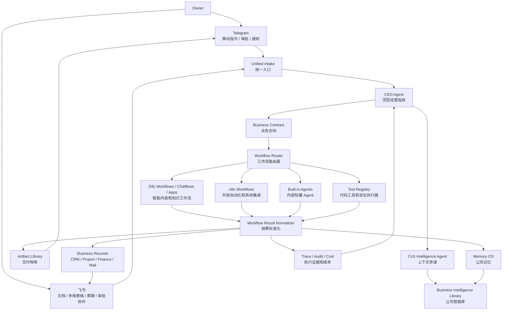

# V5 Feishu + Telegram + Dify/n8n Workflow OPC OS 架构方案

> Draft v0.1  
> 项目：Tele-OPC OS  
> 定位：全链路飞书 + Telegram 辅助 + Dify/n8n 工作流驱动的一人公司经营系统  
> 核心变化：不再让系统内部 Agent 硬写所有内容生成逻辑，而是把 Dify/n8n/飞书/工具作为可切换的 Workflow Capability Layer。Tele-OPC 负责指挥、业务对象、审批、审计、资产沉淀和跨工作流编排。

## 0. 这次升级的判断

V4 解决了“不能只是 Agent 聊天机器人”的问题，但还不够灵活。真实 OPC 运营里，老板不会只靠一个内置 Agent 生成所有内容，而是需要随业务快速切换：

- 自媒体矩阵分发工作流。
- 小红书/公众号/视频号/抖音内容生产工作流。
- 客户挖掘和线索清洗工作流。
- 报价、合同、交付物生成工作流。
- 财务、发票、收款提醒工作流。
- 飞书多维表格/文档协作工作流。
- 浏览器、邮箱、日历、文件、爬取、发布等工具链。

正确架构不是“Tele-OPC 自己写死所有智能”，而是：

```text
Owner
  -> Telegram / Feishu 输入和审批
  -> Tele-OPC Command Spine 做经营判断和编排
  -> Workflow Router 选择 Dify / n8n / 内置 Agent / Tool
  -> 外部工作流执行
  -> Tele-OPC 回收结果、审计、入库、生成资产、继续下一步
```

一句话：

> Tele-OPC V5 是 Workflow-native OPC OS。Dify/n8n 是可切换的智能和自动化发动机，飞书和 Telegram 是操作界面，Tele-OPC 是一人公司的指挥、账本、资产库和风险闸门。

## 1. V5 总架构



## 2. 系统边界重新定义

### 2.1 Tele-OPC 负责什么

Tele-OPC 是控制面和业务账本，不是把所有自动化都写死的单体系统。

它负责：

- 统一入口：Telegram、飞书、Web、文件、邮件、浏览器结果。
- 经营判断：这件事属于获客、成交、交付、内容、财务、资产、记忆还是运营。
- 工作流选择：调用哪个 Dify app、哪个 n8n workflow、哪个内置 Agent、哪个工具。
- 参数组装：把客户、项目、记忆、资料、品牌规则、平台规则拼成结构化输入。
- 审批策略：对外发布、发信、付款、删除、批量触达、高成本运行必须拦截。
- 结果标准化：把 Dify/n8n 返回变成 Artifact、Lead、Task、MemoryCandidate 等业务对象。
- 审计和复盘：保存输入、输出、引用来源、成本、执行时间、失败原因。
- 资产沉淀：所有内容、网页、PPT、脚本、计划、报告都进入 Artifact Library。

### 2.2 Dify 负责什么

Dify 适合作为智能内容和知识工作流层。

典型职责：

- 内容生成：公众号文章、小红书笔记、短视频脚本、邮件、销售话术、报告。
- 多步推理：选题 -> 大纲 -> 草稿 -> 改写 -> 平台适配 -> 质检。
- 知识库问答：品牌资料、客户资料、产品资料、行业资料。
- Agent/Workflow 编排：对单个内容生产任务内部做多节点生成。
- Prompt 和模型实验：不同内容工作流可以在 Dify 内快速迭代。

Dify 不负责：

- 公司业务对象的最终权威状态。
- 高风险动作审批。
- 跨客户/跨项目的主数据管理。
- 长期审计账本。

### 2.3 n8n 负责什么

n8n 适合作为自动化和外部系统集成层。n8n 的核心概念是 workflow、trigger、node、credential、execution、webhook，适合把很多外部系统串起来。

典型职责：

- 定时触发：每日内容发布、每周数据拉取、收款提醒。
- 外部连接：飞书、Google、Notion、Airtable、邮件、表格、HTTP API、社媒平台。
- 批量自动化：同步数据、搬运文件、更新表格、通知群聊。
- Webhook 接入：Tele-OPC 发起 n8n workflow，n8n 回调结果。
- 非 AI 的确定性自动化：格式转换、分发表、附件处理、状态同步。

n8n 不负责：

- 决定是否值得做某个经营动作。
- 最终审批策略。
- 公司记忆冲突判断。
- Artifact 和业务对象的权威版本。

### 2.4 飞书负责什么

飞书是 OPC 的协作工作台和内容生产界面，不只是通知渠道。

典型职责：

- 多维表格：内容日历、线索池、客户表、项目看板、报价表、发布记录。
- 文档：内容草稿、方案、SOP、交付物 review。
- 群聊/机器人：工作流状态通知、审批卡片、异常提醒。
- 云文档资料库：客户资料、品牌资料、内容素材、会议纪要。
- 轻量协作：未来有兼职、外包或客户参与时，不需要重做系统。

飞书不负责：

- 代替 Tele-OPC 的业务对象模型。
- 代替 Dify 的智能生成。
- 代替 n8n 的系统自动化。

### 2.5 Telegram 负责什么

Telegram 继续作为移动端命令和审批入口。

典型职责：

- 快速下命令。
- 查看短状态。
- 批准/拒绝高风险动作。
- 打开飞书文档、Artifact 预览、任务详情。
- 接收关键结果通知。

Telegram 不承载长文档、长代码、完整内容库和复杂表格。

## 3. Workflow Capability Layer

V5 新增核心模块：

```text
Workflow Capability Layer
```

它不是单个 Agent，而是一个可注册、可切换、可审计的工作流能力市场。

### 3.1 WorkflowDefinition

```ts
interface WorkflowDefinition {
  id: string;
  provider: 'dify' | 'n8n' | 'builtin' | 'http_tool';
  name: string;
  domain:
    | 'content'
    | 'social_distribution'
    | 'prospecting'
    | 'crm'
    | 'deal'
    | 'delivery'
    | 'finance'
    | 'research'
    | 'browser'
    | 'ops';
  capabilityTags: string[];
  inputSchema: unknown;
  outputSchema: unknown;
  riskLevel: 'low' | 'medium' | 'high';
  approvalPolicy: 'never' | 'before_run' | 'before_external_write' | 'always';
  costPolicy: {
    estimatedCostLevel: 'low' | 'medium' | 'high';
    requireApprovalAbove?: number;
  };
  providerConfig: {
    endpoint?: string;
    appId?: string;
    workflowId?: string;
    webhookUrl?: string;
    credentialRef?: string;
  };
  resultMapping: WorkflowResultMapping;
}
```

### 3.2 WorkflowRun

```ts
interface WorkflowRun {
  id: string;
  workflowDefinitionId: string;
  provider: 'dify' | 'n8n' | 'builtin' | 'http_tool';
  businessContractId: string;
  taskId?: string;
  projectId?: string;
  customerId?: string;
  status: 'planned' | 'queued' | 'running' | 'waiting_callback' | 'reviewing' | 'done' | 'failed' | 'cancelled';
  input: Record<string, unknown>;
  normalizedOutput?: Record<string, unknown>;
  rawOutput?: Record<string, unknown>;
  externalExecutionId?: string;
  cost?: WorkflowCost;
  traceId: string;
  createdAt: string;
  updatedAt: string;
}
```

### 3.3 Workflow Router

Workflow Router 的职责是选工作流，不是自己生成内容。

选择依据：

- 业务域：内容、分发、线索、报价、交付、财务。
- 输入类型：文本、文件、图片、链接、表格记录、飞书文档。
- 输出类型：文章、短视频脚本、PPT、表格、邮件、发布计划、线索列表。
- 平台要求：小红书、公众号、视频号、抖音、B站、LinkedIn、邮件。
- 风险级别：是否对外发布、是否批量触达、是否涉及承诺或付款。
- 成本和时效：是否允许高成本模型、多轮生成、浏览器抓取。
- 历史效果：哪个工作流过去质量更高、失败率更低、成本更低。

## 4. 飞书 + Telegram 双前台

### 4.1 为什么需要双前台

Telegram 适合移动指令和审批，但不适合内容日历、长文协作、多维表和资料沉淀。飞书适合经营工作台，但移动端快速命令不如 Telegram 直接。

所以 V5 应采用双前台：

```text
Telegram = 快速指挥台
飞书 = 经营协作台
Web = 系统管理台
```

### 4.2 Telegram 卡片

```text
W18 自媒体矩阵分发
工作流：dify/social_matrix_v3 + n8n/distribute_feishu_queue
状态：reviewing
当前：已生成 5 个平台版本，等待发布审批

按钮：
打开飞书表 / 预览内容 / 批准发布 / 要求重写 / 取消
```

### 4.3 飞书对象映射

| Tele-OPC 对象 | 飞书承载方式 | 用途 |
| --- | --- | --- |
| ContentPlan | 多维表格 | 内容日历、状态、平台、负责人、发布日期 |
| Artifact | 云文档/附件 | 长文、脚本、图片、PPT、报告 |
| Lead | 多维表格 | 线索池、评分、来源、跟进状态 |
| Project | 多维表格/项目文档 | 交付计划、里程碑、客户反馈 |
| Approval | 机器人卡片 | 发布、触达、报价、付款审批 |
| MemoryCandidate | 文档评论/卡片 | 确认是否沉淀公司记忆 |
| WorkflowRun | 多维表格/消息 | 执行状态、错误、成本、结果链接 |

## 5. 自媒体矩阵分发端到端示例

需求：

```text
老板在 Telegram 说：
下周帮我做一组 AI 一人公司主题的自媒体矩阵内容，发公众号、小红书、视频号和 LinkedIn，先给我审。
```

### 5.1 流程

```text
1. Telegram 收到输入
2. Tele-OPC 创建 InboxItem
3. CEO Agent 判断为 social_distribution / content campaign
4. CoS 检索：
   - 公司定位
   - 老板语气偏好
   - 过往爆款内容
   - 禁忌事项
   - 各平台规则
   - 目标客户画像
5. BusinessContract 生成：
   - 目标：下周矩阵内容
   - 平台：公众号、小红书、视频号、LinkedIn
   - 成功标准：每个平台有适配版本、统一主题、无内部提示词、等待审批
6. Workflow Router 选择：
   - Dify: social_matrix_content_generation_v3
   - n8n: feishu_content_calendar_sync
   - n8n: publish_queue_after_approval
7. Dify 生成：
   - 主题策略
   - 选题列表
   - 平台差异化角度
   - 公众号长文
   - 小红书笔记
   - 视频号口播脚本
   - LinkedIn post
8. Tele-OPC 标准化结果：
   - Artifact: 每个平台内容版本
   - ContentCampaign: 本次矩阵活动
   - ContentPost: 每条待发布内容
9. n8n 写入飞书：
   - 内容日历多维表
   - 每条内容生成飞书文档
   - 飞书群发 review 卡片
10. Telegram 通知老板：
   - 打开飞书表
   - 预览内容
   - 批准发布
   - 要求重写
11. 老板审批后：
   - n8n 执行发布或半自动发布队列
   - Tele-OPC 记录发布结果、链接、数据回收任务
12. 发布后：
   - n8n 定时回收数据
   - Dify/CoS 总结复盘
   - Memory Agent 生成内容偏好和平台经验候选
```

### 5.2 关键对象

```ts
interface ContentCampaign {
  id: string;
  shortCode: string;
  title: string;
  platforms: string[];
  goal: string;
  status: 'planning' | 'generating' | 'reviewing' | 'scheduled' | 'publishing' | 'published' | 'reviewed';
  ownerReviewRequired: boolean;
  feishuBaseUrl?: string;
  feishuFolderUrl?: string;
  workflowRunIds: string[];
}

interface ContentPost {
  id: string;
  campaignId: string;
  platform: 'wechat' | 'xiaohongshu' | 'video_account' | 'douyin' | 'bilibili' | 'linkedin' | 'email';
  title: string;
  bodyArtifactId: string;
  mediaArtifactIds: string[];
  status: 'draft' | 'reviewing' | 'approved' | 'scheduled' | 'published' | 'failed';
  scheduledAt?: string;
  publishedUrl?: string;
  metrics?: Record<string, unknown>;
}
```

### 5.3 审批边界

可以自动：

- 生成内容草稿。
- 生成平台适配版本。
- 写入飞书表格和文档。
- 创建发布计划。
- 生成封面图 prompt 或素材建议。
- 回收公开数据。

必须审批：

- 正式对外发布。
- 批量私信或邮件触达。
- 使用客户案例、收入数字、承诺性表述。
- 删除或覆盖已发布内容。
- 高成本批量生成。

## 6. V5 导航升级

V4 导航保留，但新增 Workflow 和 Content Ops。

```text
/app/cockpit
/app/inbox
/app/workflows
/app/content
/app/distribution
/app/tasks
/app/projects
/app/crm
/app/deals
/app/artifacts
/app/library
/app/memory
/app/finance
/app/mail
/app/calendar
/app/browser
/app/agents
/app/integrations
/app/settings
```

### 6.1 新页面

| 页面 | 目的 | 核心对象 | MVP |
| --- | --- | --- | --- |
| Workflows | 管理 Dify/n8n/内置工作流能力 | WorkflowDefinition, WorkflowRun | 注册工作流、测试运行、查看失败和成本 |
| Content | 内容生产中心 | ContentCampaign, ContentPost, Artifact | 内容日历、草稿、平台版本、review 状态 |
| Distribution | 分发和发布队列 | PublishJob, ChannelAccount, PlatformPolicy | 待发布、已发布、失败重试、数据回收 |
| Integrations | 外部系统连接 | IntegrationAccount, CredentialRef, WebhookEndpoint | Dify、n8n、飞书、Telegram、邮箱、社媒账号健康状态 |

## 7. Integration Layer

### 7.1 Dify Connector

```ts
interface DifyConnector {
  runWorkflow(input: {
    workflowId: string;
    inputs: Record<string, unknown>;
    responseMode: 'blocking' | 'streaming';
    user: string;
  }): Promise<ExternalWorkflowResult>;
}
```

需要支持：

- workflow/app 配置。
- blocking 和 callback/streaming 两种执行方式。
- raw output 保存。
- 标准化 output mapping。
- 失败重试。
- token/cost 记录。
- Dify 知识库和 Tele-OPC Library 的边界映射。

### 7.2 n8n Connector

```ts
interface N8nConnector {
  triggerWebhook(input: {
    workflowId: string;
    webhookUrl: string;
    payload: Record<string, unknown>;
  }): Promise<ExternalWorkflowResult>;

  getExecution?(executionId: string): Promise<ExternalWorkflowExecution>;
}
```

需要支持：

- webhook trigger。
- execution id 回收。
- credential 不进 Tele-OPC 明文。
- 失败回调。
- 幂等 key。
- 发布/发信/写表等外部写动作审批。

### 7.3 Feishu Connector

```ts
interface FeishuConnector {
  createDocument(input: CreateFeishuDocInput): Promise<FeishuDocRef>;
  upsertBitableRecord(input: UpsertBitableRecordInput): Promise<FeishuRecordRef>;
  sendBotCard(input: SendFeishuCardInput): Promise<FeishuMessageRef>;
  receiveEvent(input: FeishuEvent): Promise<void>;
}
```

需要支持：

- 机器人消息卡。
- 云文档创建和更新。
- 多维表格记录同步。
- 飞书事件回调。
- 飞书用户和 Tele-OPC Owner/Operator 映射。

## 8. 数据模型新增

```text
workflow_definitions
workflow_runs
workflow_run_events
integration_accounts
credential_refs
external_object_refs
content_campaigns
content_posts
publish_jobs
channel_accounts
platform_policies
feishu_spaces
feishu_documents
feishu_bitable_records
```

### 8.1 ExternalObjectRef

```ts
interface ExternalObjectRef {
  id: string;
  provider: 'dify' | 'n8n' | 'feishu' | 'telegram' | 'wechat' | 'xiaohongshu' | 'linkedin' | 'other';
  externalType: 'workflow' | 'execution' | 'document' | 'record' | 'message' | 'post' | 'file';
  externalId: string;
  url?: string;
  localObjectType: string;
  localObjectId: string;
  metadata: Record<string, unknown>;
}
```

### 8.2 PlatformPolicy

```ts
interface PlatformPolicy {
  id: string;
  platform: string;
  publishMode: 'manual' | 'semi_auto' | 'auto_after_approval';
  requireApproval: boolean;
  prohibitedClaims: string[];
  formattingRules: string[];
  maxDailyPosts?: number;
  metadata: Record<string, unknown>;
}
```

## 9. 工作流注册样例

### 9.1 Dify 内容矩阵工作流

```yaml
id: dify.social_matrix_content_v3
provider: dify
domain: social_distribution
capabilityTags:
  - content_generation
  - platform_adaptation
  - social_matrix
riskLevel: medium
approvalPolicy: before_external_write
input:
  topic: string
  targetAudience: string
  platforms: string[]
  brandVoice: string
  sourceMaterials: ContextRef[]
output:
  campaignStrategy: object
  posts: ContentPostDraft[]
  reviewNotes: string[]
```

### 9.2 n8n 飞书同步工作流

```yaml
id: n8n.feishu_content_calendar_sync
provider: n8n
domain: social_distribution
capabilityTags:
  - feishu
  - bitable
  - document_sync
riskLevel: low
approvalPolicy: never
input:
  campaign: ContentCampaign
  posts: ContentPostDraft[]
output:
  feishuBaseUrl: string
  feishuDocUrls: string[]
```

### 9.3 n8n 发布队列工作流

```yaml
id: n8n.publish_queue_after_approval
provider: n8n
domain: social_distribution
capabilityTags:
  - publish_queue
  - external_write
riskLevel: high
approvalPolicy: before_run
input:
  approvedPosts: ContentPost[]
  platformPolicies: PlatformPolicy[]
output:
  publishJobs: PublishJob[]
```

## 10. 迁移路线图

### P0：Workflow Registry

目标：

- 新增 `workflow_definitions`、`workflow_runs`、`external_object_refs`。
- 支持手工注册 Dify/n8n workflow。
- Tele-OPC 可以从 Telegram 创建一个 WorkflowRun。

### P1：Dify Connector

目标：

- 支持调用 Dify workflow。
- 保存 raw output 和 normalized output。
- 输出映射为 Artifact / ContentPost / MemoryCandidate。

### P2：n8n Connector

目标：

- 支持 webhook trigger。
- 支持 execution/callback 结果回收。
- 所有外部写动作接入审批策略。

### P3：飞书 Connector

目标：

- 创建飞书文档。
- 写入多维表格。
- 发送机器人卡片。
- 飞书记录和 Tele-OPC 对象互相引用。

### P4：Content Ops MVP

目标：

- `/app/content` 内容日历。
- `/app/distribution` 发布队列。
- Telegram 一句话创建内容矩阵任务。
- Dify 生成内容，n8n 写飞书，老板审批后进入发布队列。

### P5：工作流效果复盘

目标：

- 每个 WorkflowDefinition 记录成功率、平均耗时、成本、人工返工次数。
- CEO Agent 选择工作流时使用历史效果。
- Memory Agent 从高质量结果中提取规则和 SOP 候选。

### P6：工作流市场化

目标：

- 按业务场景管理 workflow：自媒体、线索、报价、交付、财务。
- 支持一键切换 Dify 工作流版本。
- 支持 A/B 测试不同工作流。

## 11. 验收标准

V5 第一阶段完成后，应满足：

- Telegram 可以发一句话创建“自媒体矩阵分发”任务。
- CEO Agent 不直接写长内容，而是选择 Dify workflow。
- n8n 能把 Dify 结果写入飞书内容日历和文档。
- 飞书里能 review 草稿，Telegram 能收到审批卡。
- 审批通过前不会自动发布。
- 所有 Dify/n8n 执行都有 WorkflowRun、Trace、Raw Output、Normalized Output。
- 所有生成内容进入 Artifact Library。
- 发布结果、外部链接、失败原因都回写 Tele-OPC。
- Workflow 可以按场景切换，而不是改代码。

## 12. 最终定义

Tele-OPC V5 应该是：

> 一个 Workflow-native 的一人公司经营系统。老板通过 Telegram 快速指挥，通过飞书协作和 review；Tele-OPC 负责业务判断、审批、资产和审计；Dify 负责智能内容和知识工作流；n8n 负责外部自动化和系统集成；所有结果最终沉淀为客户、项目、任务、交付物、记忆、财务和复盘资产。

